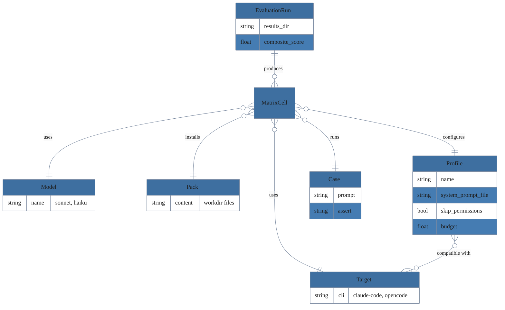
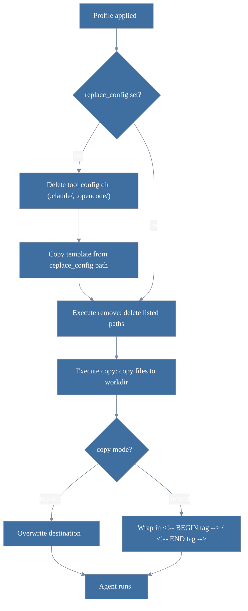

# lola-eval - Evaluation harness for Lola packs

A system-packaged embeddable test runner that verifies lola packs still produce useful results when run through
`claude-code` or `opencode` at a particular model version. Target projects embed it like any other test suite; results
stay in the target repo for trend analysis and CI/CD integration.


----

> 🤖 LLM WARNING 🤖
>
> This project was written with LLM (AI) assistance.
>
> 🤖 LLM WARNING 🤖

----

## Status

Pre-1.0. Configuration schema, on-disk layouts under `<results_dir>/`, and CLI flags can change
without notice between releases. Pin the RPM version in CI and re-run `lola-eval doctor` after any
upgrade.

## Install

Distribution is RPM only. The package is self-contained: Python 3.12.6, Node 22.22.2, and
promptfoo 0.121.11 are all bundled under `/opt/lola-eval/`. The pin manifest
(`/opt/lola-eval/share/versions.txt`) ships with the RPM so `lola-eval doctor` can verify the
bundled binaries match what was pinned at build time and that the bundled Node satisfies
promptfoo's `engines.node` constraint.

```sh
sudo dnf install ./dist/lola-eval-0.2.0-1.el10.x86_64.rpm
```

Runtime prerequisites (not bundled; must be on `PATH`):

- `lola` — the lola CLI (required; drives pack install/uninstall)
- `claude` — for `claude-code` targets
- `opencode` — for `opencode` targets (optional unless configured)

Run `lola-eval doctor` after install to verify the environment.

## Quick start

```sh
cd /path/to/your/project
lola-eval init                     # scaffolds lola-eval.yaml + tests/lola-eval/example/
$EDITOR lola-eval.yaml            # configure targets, packs, threshold mode
lola-eval test                     # runs the matrix; exit code reflects pass/fail
cat .lola-eval/junit.xml          # CI-consumable result
```

**For a step-by-step practical guide** (install → bootstrap → author tests → wire to CI →
adopt regression mode → multi-judge consensus), read [docs/walkthrough.md](docs/walkthrough.md).
The rest of this README is reference material.

## Configuration

Minimal `lola-eval.yaml`:

```yaml
targets:
  - cli: claude-code
    models: [sonnet]

packs:
  - none                            # baseline (no pack installed)
  - example-pack@<40-char-sha>

threshold:
  mode: absolute                    # absolute | regression | both
```

### Threshold modes

| Mode | Behaviour | State required |
|------|-----------|----------------|
| `absolute` (default) | Each test fails when `composite < rubric.pass_threshold`. Stateless; works on first run. | None |
| `regression` | Fails when `composite < baseline[cell] - tolerance`. | `baseline.json` committed in repo |
| `both` | Either condition triggers failure. Most signal; recommended for mature setups. | `baseline.json` |

Switching modes:

```yaml
threshold:
  mode: regression
  tolerance: 0.05
```

In `regression` mode, run `lola-eval baseline update` after a good run and commit the resulting
`.lola-eval/baseline.json`.

`baseline.json` is a flat JSON object keyed by cell. When profiles are in use, the key includes the
profile: `<cli>/<model>/<task_id>/<pack_id>/<profile_id>`. Without profiles: `<cli>/<model>/<task_id>/<pack_id>`.

```json
{
  "claude-code/sonnet/case-001/none": {"composite": 0.85},
  "claude-code/sonnet/case-001/example-pack@<sha>/bare": {"composite": 0.91}
}
```

`composite` is a float in `[0, 1]`. Update via `lola-eval baseline update`; review the diff with
`lola-eval baseline diff` before committing.

## Profiles



Profiles add an environment-configuration axis to the evaluation matrix. While packs control what
content gets installed in the workdir, profiles control how the agent runtime is configured: config
directories, CLI flags, prompt variants, and permission modes. The two axes are orthogonal and
combine freely.

When profiles are configured, the matrix becomes **target × model × pack × profile × case**.

### Why profiles

Different agent configurations produce different results on the same task. A bare agent (no
plugins, no system prompt) behaves differently from one loaded with a framework like Superpowers
or Unbound Force. Profiles let you compare these configurations systematically without maintaining
separate config files or wrapper scripts.

### Setting up profiles

Create a `profiles/` directory alongside your `lola-eval.yaml`:

```
my-project/
├── lola-eval.yaml
├── profiles/
│   ├── common.yaml          # shared defaults (optional)
│   ├── bare.yaml            # clean room baseline
│   └── personal.yaml        # with AGENTS.md injected
└── tests/lola-eval/
    └── my-case/
```

Reference them in `lola-eval.yaml`:

```yaml
targets:
  - cli: claude-code
    models: [sonnet]

profiles_dir: ./profiles
profiles:
  - bare
  - personal

threshold:
  mode: absolute
```

### Profile YAML schema

Each profile file defines how the agent environment is set up:

```yaml
name: bare
description: Clean room - no plugins, no system prompt
compatible_targets:
  - claude-code
  - opencode

# Prompt tiers
pre_prompt: ""               # prepended to task prompt (e.g., "/unleash")
prompt: null                 # null = use task prompt; string = override entirely
post_prompt: []              # follow-up messages after main run (null = inherit)

# Environment
system_prompt_file: ""       # null = inherit; "" = explicitly none
skip_permissions: true       # maps to tool-specific auto-approve flag
budget: 10.0                 # USD per cell (max of profile and task.yaml wins)
timeout: 1800                # seconds per cell (max of profile and task.yaml wins)

# Per-target setup directives
setup:
  claude-code:
    flags: ["--bare"]                    # appended to CLI args
    replace_config: configs/claude-bare  # path to config dir template
    remove: [AGENTS.md, CLAUDE.md]       # deleted from workdir
    copy:                                # files copied into workdir
      - src: fixtures/AGENTS.md
        dst: AGENTS.md
        mode: append                     # "replace" (default) or "append"
        tag: my-section                  # bookend marker name for append mode
```

### Inheritance

All keys except `name` and `setup` inherit from `common.yaml` (if present in `profiles_dir`).
Profile values override common values. `setup` is never inherited — each profile must define its
own setup directives for every target it declares in `compatible_targets`.

### Setup directives



Directives execute in order before the agent runs:

1. **`replace_config`** — deletes the tool's config directory (`.claude/` or `.opencode/`) from the
   workdir and copies the template in its place. Prevents user plugins and settings from bleeding
   into the evaluation.

2. **`remove`** — deletes listed paths from the workdir (no error if missing).

3. **`copy`** — copies files into the workdir. In `append` mode, content is wrapped in
   `<!-- BEGIN tag -->` / `<!-- END tag -->` bookend markers for idempotent re-application.

### Null vs empty semantics

Profile fields use `null` (or omission) to mean "inherit from common.yaml or task.yaml" and
explicit empty values to mean "override to nothing":

| Field | `null` / absent | `""` or `[]` |
|---|---|---|
| `system_prompt_file` | Inherit from task.yaml | No system prompt |
| `post_prompt` | Inherit from task.yaml | No follow-up messages |

### Filtering

Run a single profile:

```sh
lola-eval test --profile bare
```

### Tool registry

The tool registry at `src/lola_eval/_data/tools.json` maps CLI names to their config conventions
(config directory names, environment variables, permission flags). Adding support for a new tool
(Cursor, Windsurf, etc.) requires one registry entry and one provider JS file.

## Configuration reference

Authoritative descriptions of every field actually read at runtime. Maintainer-facing internals
(fingerprint composition, judge protocol, persistence schema) live in the design spec.

### `lola-eval.yaml`

| field | type | required | default | meaning |
|-------|------|----------|---------|---------|
| `targets` | list | yes | — | one entry per agent CLI under test |
| `targets[].cli` | enum | yes | — | `claude-code` or `opencode` |
| `targets[].models` | list[string] | yes | — | model identifiers to evaluate (one row per model) |
| `targets[].exec_mode` | enum | no | `autonomous` | `autonomous` (one-shot) or `interactive` (multi-turn dialog driven by a simulated user) |
| `targets[].max_turns` | int | no | `5` | hard cap on dialog turns; honored only when `exec_mode=interactive` |
| `targets[].simulated_user_cli` | enum | no | `opencode` | CLI that plays the human side in interactive mode |
| `targets[].simulated_user_model` | string | no | `""` | model the simulated user runs as; `""` falls back to the target's first model |
| `packs` | list[string] | yes | — | pack ids; `none` is the baseline (no pack); other entries must use `<name>@<ref>` (see Pack pinning) |
| `threshold.mode` | enum | no | `absolute` | `absolute`, `regression`, or `both` |
| `threshold.tolerance` | float | no | `0.05` | regression slack; row fails if `composite < baseline - tolerance` |
| `threshold.timeout_is_failure` | bool | no | `true` | `true` -> exit 3 on any timed-out row; `false` -> ignore |
| `concurrency` | int | no | `4` | promptfoo `maxConcurrency`; integer in `[1, 64]` |
| `tests_dir` | string | no | `tests/lola-eval` | path (relative to config) where case directories live |
| `results_dir` | string | no | `.lola-eval` | path for runs.db, transcripts, reports, junit, last-run |
| `judges` | list | no | first target's `(cli, model)` | one or more judges; multi-entry enables consensus scoring |
| `judges[].cli` | enum | yes | — | `claude-code` or `opencode` |
| `judges[].model` | string | yes | — | model id used for the judge call |
| `aggregation` | enum | no | `mean` | how to fold per-judge scores: `mean`, `median`, `min`, or `trimmed_mean` (drops min+max; requires N≥3 judges) |
| `disagreement_threshold` | float | no | `0.15` | per-criterion stddev cap; `disagreement_action` decides what happens above it |
| `disagreement_action` | enum | no | `warn` | `warn` (stderr; current behavior), `fail` (row marked failed with `failure_kind=judge_disagreement`), or `off` (silent) |
| `ci.junit_xml` | bool | no | `true` | write `<results_dir>/junit.xml` |
| `ci.github_summary` | bool | no | `true` | append a markdown table to `$GITHUB_STEP_SUMMARY` if set |
| `ci.html_report` | bool | no | `true` | render `<results_dir>/reports/<ts>.html` per run |
| `runner_timeout_seconds` | int | no | `3600` | hard upper bound on the promptfoo subprocess |
| `profiles_dir` | string | no | — | directory containing profile YAML files; required when `profiles` is set |
| `profiles_common` | string | no | `common.yaml` | filename for shared profile defaults (relative to `profiles_dir`) |
| `profiles` | list[string] | no | — | profile names to include; omit to include all profiles in directory |

### `task.yaml`

Lives at `<tests_dir>/<case-id>/task.yaml`. The directory name is the `task_id`.

| field | type | required | default | meaning |
|-------|------|----------|---------|---------|
| `task_version` | string | yes | — | bump on any behaviour change; flows into the row fingerprint |
| `description` | string | no | — | free-form human note (not surfaced in reports) |
| `timeout_seconds` | int | no | `600` | per-row timeout passed to the agent CLI |
| `budget_usd` | float | no | `10.0` | per-row budget passed to the agent CLI |
| `target_extra_args` | string | no | — | extra CLI flags appended to the agent command |
| `system_prompt_file` | string | no | — | path to system prompt file (claude-code only) |
| `followup_messages` | list[string] | no | — | messages sent after the main run succeeds |
| `starter_url` | string | no | — | GitHub URL for remote starter (shallow-cloned once, copied per cell) |
| `starter_ref` | string | no | — | branch/tag for remote starter |
| `starter_shallow_since` | string | no | `30 days ago` | shallow clone depth for remote starter |

### `rubric.md` frontmatter

`rubric.md` consists of a YAML frontmatter block (between `---` lines) followed by a free-form
markdown body shown to the judge.

| field | type | required | default | meaning |
|-------|------|----------|---------|---------|
| `rubric_version` | string | yes | — | bump on rubric edits; flows into the fingerprint |
| `pass_threshold` | float | yes | — | composite must reach this to pass in `absolute` mode |
| `weights` | mapping[string, float] | yes | — | per-criterion weights; **must sum to 1.0 (±0.001)** |

The body explains what each criterion means; the judge consumes it verbatim.

## CI integration

```yaml
- name: Install lola-eval
  run: |
    wget https://example.invalid/releases/lola-eval-0.2.0-1.el10.x86_64.rpm
    sudo dnf install -y ./lola-eval-0.2.0-1.el10.x86_64.rpm

- name: Run lola-eval
  run: lola-eval test

- name: Upload junit
  if: always()
  uses: actions/upload-artifact@v4
  with:
    name: lola-eval-results
    path: .lola-eval/junit.xml
```

Note: the `wget` URL is a placeholder; substitute your actual release location. The step also
assumes `lola` and `claude` (or `opencode`) are already installed in the runner environment.

Exit codes:

| Code | Meaning |
|------|---------|
| `0`  | All rows passed threshold |
| `1`  | At least one row failed threshold grading (composite below `pass_threshold`, regression beyond tolerance, or `judge_disagreement` with `disagreement_action: fail`) |
| `2`  | Setup error before the matrix could run (invalid config, missing baseline in regression mode, malformed rubric) |
| `3`  | Infrastructure failure on at least one row: timeout (with `timeout_is_failure: true`), `no_run_produced`, `judge_error`, or `setup_error` (e.g. `lola install` returned "Module not found"). The cell's `failure_reason` carries the actionable message. |

Precedence is `2 > 3 > 1 > 0` — setup errors trump everything; infra failures trump threshold ones.

### Recovery from interrupted runs

If `lola-eval test` is killed mid-run (Ctrl-C, CI timeout, OOM kill), inspect `<results_dir>/`:

- `<results_dir>/workspace/` is regenerated on every test invocation. Safe to delete or just re-run.
- `<results_dir>/runs.db` may contain partial-run rows from before the interruption. These are
  harmless: re-running produces fresh rows with later timestamps that take precedence in `compare`,
  `lift`, `drift`, and `last-run.json`.
- `<results_dir>/baseline.json` is never modified by `test`; only `lola-eval baseline update` writes it.

For most cases, just re-run `lola-eval test`. If you want a clean slate, `lola-eval clean --cache`
wipes the regenerable workspace/transcripts/reports without touching `runs.db` or `baseline.json`.

## Authoring tests

`lola-eval init` scaffolds the directory structure. Each test case lives under
`tests/lola-eval/<case-id>/`:

```
tests/lola-eval/
└── my-case/             # directory name IS the task_id
    ├── task.yaml        # task_version, description, timeout_seconds
    ├── prompt.md        # instructions given to the agent
    ├── rubric.md        # rubric_version, pass_threshold, per-criterion weights
    └── starter/         # files copied verbatim into the agent's working directory
```

`task.yaml` fields actually read by the runner:

| field | type | required | default | meaning |
|-------|------|----------|---------|---------|
| `task_version` | string | yes | — | bump on every behaviour change; flows into the fingerprint |
| `description` | string | no | — | free-form human note (not surfaced in reports) |
| `timeout_seconds` | int | no | 600 | per-row timeout passed to the agent CLI |

`task_id` is derived from the case directory name. Do not set it inside `task.yaml`.

The example scaffolded by `lola-eval init` is runnable without modification. See
`examples/tests/lola-eval/` in this repo for a reference.

## Pack pinning

`packs:` entries take the form `<pack-name>` or `<pack-name>@<ref>`. The bare form (e.g. `none`)
is special-cased as the lift baseline (no pack installed). Any other entry must include an `@<ref>`
suffix that pins the pack revision so results are reproducible.

`<ref>` is whatever the lola CLI accepts as a version anchor — typically a 40-character git SHA.
To resolve a SHA for a published pack:

```sh
lola show example-pack --json | jq -r '.head_sha'
```

The runner strips `@<ref>` before invoking `lola install` (the suffix is recorded in the row's
fingerprint, not in the install command). This means two configs that pin different SHAs of the
same pack produce different fingerprints and are graphed/regressed independently.

`@local` is reserved as a developer escape hatch for "use the working copy on disk"; do not
ship it in committed configs.

## Building from source

```sh
task setup               # install deps (uv sync + npm install)
task test                # run all tests (pytest + vitest + bats)
task build:wheel         # produce dist/lola_eval-*.whl
task package:rpm         # produce dist/lola-eval-*.rpm via Containerfile
task package:rpm:smoke   # install built RPM in clean container; run doctor
```

Pinned Python, Node, and promptfoo versions live in `packaging/versions.txt`. The RPM build
copies that file into the bundle at `/opt/lola-eval/share/versions.txt`, where `lola-eval doctor`
compares it against the installed binaries on every invocation. Bumping any version is a
deliberate edit followed by a full `task package:rpm:smoke` pass.

## Repository layout

| Path | Purpose |
|------|---------|
| `src/lola_eval/` | Runner, CLI, profile loader, and judge protocol (Python). Bundled JS providers under `_data/providers/`, tool registry at `_data/tools.json`, bundled profile configs at `_data/profiles/` |
| `tests/` | `python/` (unit), `integration/` (fake CLIs), `node/` (vitest), `bats/`, `fixtures/` |
| `packaging/rpm/` | `Containerfile`, RPM spec, and `build.sh` for the distributed RPM. Pinned versions in `packaging/versions.txt` |
| `examples/` | Reference target-project layout (`lola-eval.yaml` + cases under `tests/lola-eval/`); driven by `task smoke` |
| `docs/` | `walkthrough.md` (user-facing walkthrough) |
| `packs/SCHEMA.md` | Reference schema for pack lock manifests |
| `pyproject.toml`, `uv.lock` | Python project metadata and pinned deps (managed via `uv`) |
| `package.json`, `package-lock.json`, `vitest.config.js` | Node deps and JS test config (provider tests under `tests/node/`) |
| `Taskfile.yml` | Build/test/lint/package recipes — see `task --list` |
| `.containerignore` | Build-context exclusions for `task package:rpm` |
| `dist/` | Build artifacts (gitignored; produced by `task build:wheel` and `task package:rpm`) |

## Troubleshooting

Common first-run failure modes and how to recover.

### `task test` fails with "No module named 'lola_eval'"

The editable install is missing or stale. Recreate the venv:

```sh
rm -rf .venv && task setup
```

The `Taskfile.yml` already pins `.venv/bin/python` rather than `uv run`, so this surfaces loud
during `task setup` instead of getting masked by a fallback to system Python. If you invoke
`pytest` directly outside the Taskfile, do the same wipe.

### `lola-eval test` shows `no_run_produced` failures

The agent CLI subprocess returned, but the judge never persisted a row. This is an infrastructure
problem, not a real test failure — the threshold engine surfaces it as exit code 3 with the
distinguishing reason. Check the stderr above the failure list for the actual cause. Most common:

- `PYTHONPATH` not propagated to the judge subprocess (verifies via `lola-eval doctor` -> bundle
  integrity check).
- `promptfoo` crashed mid-run; look for a Node traceback above.
- sqlite contention (`runs.db` busy); re-run.
- `trajectory_judge` import error; check that `lola_eval` resolves cleanly via the bundle.

### `lola-eval test` shows `setup_error` failures

The provider couldn't prepare the row before the agent ran. Distinct from `no_run_produced`:
here the runner knows *exactly* what failed because the provider caught the error and persisted it.
The most common cause is `lola install <pack>` returning "Module not found" — the row's
`failure_reason` will carry that line verbatim (e.g.
`install_pack.sh: FAILED pack=example-pack@local target=claude-code: Module 'example-pack' not found`).
Exits 3 like other infra failures. Fix: install the missing pack via `lola mod add` / `lola install`
before re-running, or move to Mode 1 if the project owns its pack provisioning.

### `lola-eval test` shows `target_error` for every row

The agent CLI itself is failing to launch or returning non-zero. Verify outside lola-eval:

```sh
claude --version       # for claude-code targets
opencode --version     # for opencode targets
```

If those work but lola-eval still fails, check the per-row transcript at
`<results_dir>/transcripts/<run_id>.jsonl` to see what the agent wrote before crashing.

### `lola-eval baseline diff` shows nothing

`baseline diff` compares `baseline.json` against `last-run.json`. If the latter is absent, no
successful `lola-eval test` has produced rows in this repo yet. Run `lola-eval test` first.

### Pack install fails with "lola: command not found"

`lola` (the pack CLI) is a hard runtime dependency that the lola-eval RPM does not bundle. Install
it separately per its own docs. `lola-eval doctor` checks this on every invocation.

## License

Apache-2.0
