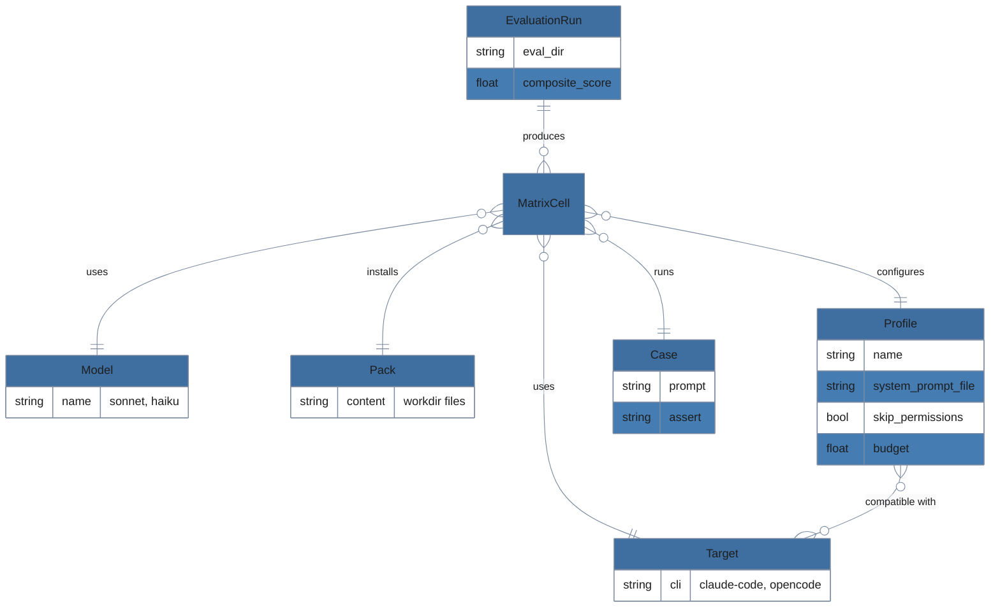
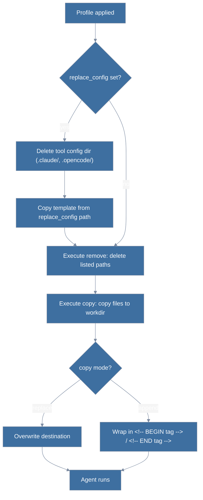

# lola-eval - Evaluation harness for Lola packs

A system-packaged embeddable test runner that verifies lola packs still produce useful results when run through `claude-code` or `opencode` at a particular model version. Target projects embed it like any other test suite; results stay in the target repo for trend analysis and CI/CD integration.

______________________________________________________________________

> 🤖 LLM WARNING 🤖
>
> This project was written with LLM (AI) assistance.
>
> 🤖 LLM WARNING 🤖

______________________________________________________________________

## Contents

- [Status](#status) — pre-1.0 stability notes; current breaking change
- [Install](#install) — RPM install + footprint
- [Quick start](#quick-start) — first commands
- [CLI reference](#cli-reference) — subcommand table + `--config` semantics
- [Configuration](#configuration) — Mode-1 vs Mode-2; minimal examples; threshold modes
- [Profiles](#profiles) — what a profile is; conflict-detection workflow
- [Configuration reference](#configuration-reference) — every field actually read at runtime
- [CI integration](#ci-integration) — exit codes; interrupted-run recovery; `clean --cache` / `--state`
- [Authoring tests](#authoring-tests) — `task.yaml` and the test-set layout
- [Pack pinning](#pack-pinning) — Mode-2 `<name>@<ref>` form
- [Building from source](#building-from-source) — Mock setup; troubleshooting
- [Repository layout](#repository-layout) — what lives where
- [Troubleshooting](#troubleshooting) — first-run failure modes
- [`SECURITY.md`](SECURITY.md) — threat model (separate file)

## Status

Pre-1.0. Configuration schema, on-disk layout, and CLI flags can change without notice between releases. Pin the RPM version in CI and re-run `lola-eval doctor` after any upgrade.

### Breaking change: fingerprint v2

The fingerprint algorithm was bumped to version `"2"` (see `FINGERPRINT_VERSION` in `src/lola_eval/fingerprint.py`). This change adds `subject_version` to the identity hash and prefixes the payload with the version string, which **invalidates all pre-existing drift baselines**. Rows written by older releases have `fingerprint_version=NULL` in `runs.db` and will NOT match rows written by this
release. After upgrading:

1. Re-run `lola-eval test` to populate the store with v2 fingerprints.
1. Re-run `lola-eval baseline update` and commit the new `baseline.json` if you use `regression` or `both` threshold mode.

Old rows are preserved in `runs.db` but `drift`, `graph`, `compare`, and `lift` will show them as a separate lineage (or not at all, if your drift query spans the version boundary).

## Install

Distribution is RPM only. The package is self-contained: Python 3.12.6, Node 22.22.2, and promptfoo 0.121.11 are all bundled under `/opt/lola-eval/`. Versions are pinned in the RPM spec file (`packaging/rpm/lola-eval.spec`) and `lola-eval doctor` verifies the bundled binaries match what was pinned at build time and that the bundled Node satisfies promptfoo's `engines.node` constraint.

```sh
sudo dnf install ./dist/lola-eval-0.2.0-1.el10.x86_64.rpm
```

Footprint: the package is ~490 MB compressed and lands ~2.0 GB on disk (most of it is the bundled promptfoo `node_modules/` tree at `/opt/lola-eval/share/promptfoo/`). Install completes in under two minutes on a primed `dnf` cache and a fast network.

Runtime prerequisites (not bundled; must be on `PATH`):

- `lola` — the lola CLI (required; drives pack install/uninstall)
- `claude` — for `claude-code` targets
- `opencode` — for `opencode` targets (optional unless configured)

Run `lola-eval doctor` after install to verify the environment.

## Quick start

```sh
cd /path/to/your/project
lola-eval init                     # scaffolds .lola-eval/config.yaml + .lola-eval/test_sets/example/
$EDITOR .lola-eval/config.yaml    # configure targets, packs, threshold mode
lola-eval test                     # runs the matrix; exit code reflects pass/fail
cat .lola-eval/out/junit.xml      # CI-consumable result

# Explore historical results
lola-eval export --format csv --out runs.csv          # export runs.db as JSON or CSV
lola-eval transcript-diff <run_a> <run_b>             # semantic diff of two stored runs
lola-eval compare-ref main HEAD                       # diff composites across two git refs
```

**For a step-by-step practical guide** (install → bootstrap → author tests → wire to CI → adopt regression mode → multi-judge consensus), read [docs/walkthrough.md](docs/walkthrough.md). The rest of this README is reference material.

## CLI reference

### Subcommands

| Subcommand                              | Purpose                                                                                                                                           |
| --------------------------------------- | ------------------------------------------------------------------------------------------------------------------------------------------------- |
| `lola-eval init`                        | Scaffold `.lola-eval/config.yaml` + an example test in the current project                                                                        |
| `lola-eval test`                        | Run the eval matrix; exits 0/1/2/3                                                                                                                |
| `lola-eval doctor`                      | Verify the environment (bundle, CLIs, rubric weights)                                                                                             |
| `lola-eval baseline show\|update\|diff` | Manage the committed regression baseline                                                                                                          |
| `lola-eval compare`                     | Exhaustive baseline-vs-pack table from `runs.db`                                                                                                  |
| `lola-eval lift`                        | Signed lift % per cell                                                                                                                            |
| `lola-eval drift`                       | Signed composite delta per fingerprint                                                                                                            |
| `lola-eval graph`                       | ANSI time-series chart                                                                                                                            |
| `lola-eval report`                      | Rebuild the HTML/markdown report from `runs.db`                                                                                                   |
| `lola-eval clean`                       | Wipe regenerable or state artifacts                                                                                                               |
| `lola-eval export`                      | Export `runs.db` history as JSON or CSV                                                                                                           |
| `lola-eval transcript-diff`             | Semantic diff of two stored runs                                                                                                                  |
| `lola-eval compare-ref`                 | Eval the repo at two git refs and diff composites                                                                                                 |
| `lola-eval profile-compare`             | Compare composites across installed-skill profiles and flag skill conflicts (a profile whose skills are a superset of another's but scores lower) |
| `lola-eval predict`                     | Print three-tier cost estimates for every cell with kNN prediction enabled. Equivalent to `lola-eval test --estimate-cost --predict` but skips the test machinery   |

`lola-eval test` accepts `--config <path>` to point at any `.lola-eval/config.yaml` regardless of the current working directory. When `--config` is absent it resolves `.lola-eval/config.yaml` relative to the cwd. Passing the eval dir itself (e.g. `--config .lola-eval/`) auto-redirects to `<dir>/config.yaml`. The `--out <path>` flag forces the output root (default: `.lola-eval/out/` for in-repo
runs; XDG for external). All read-only subcommands (`drift`, `lift`, `compare`, `graph`, `report`, `export`, `transcript-diff`) tolerate "no config" and fall back to XDG state when invoked outside a repo.

#### Config variants (`config.<name>.yaml`)

A single `.lola-eval/` directory may hold multiple config files that share the same `test_sets/`, `profiles/`, and `baseline.json`. The default is `config.yaml`; sibling `config.<name>.yaml` files are selected with `--config`:

```sh
.lola-eval/
  config.yaml          # default (e.g. CI: cheap models)
  config.live.yaml     # real-cost models for periodic live runs
  config.local.yaml    # whatever you iterate on locally
  test_sets/ profiles/ baseline.json …
```

```sh
lola-eval test                                       # uses config.yaml
lola-eval test --config .lola-eval/config.live.yaml  # uses the live variant
```

This is the recommended way to run the same suite against different targets/judges without duplicating fixtures. `examples/default/.lola-eval/` in this repo uses this pattern.

#### Cost estimation (`--estimate-cost`)

`lola-eval test --estimate-cost` prints an upper-bound cost block and exits without invoking any LLM. Per-model rates and context limits are pulled from a bundled snapshot of [models.dev](https://models.dev/) (the same registry opencode reads). The snapshot ships at `src/lola_eval/_data/pricing/models.json` with a `models.json.sha256` attestation file; verify integrity with `task pricing:verify`,
refresh with `task pricing:update` (no network access at runtime).

The block shows per-model upper-bound cost (`limit.context − limit.output` tokens at the snapshot's `cost.input`/`cost.output` rate per million tokens) and a per-cell total. Models absent from the snapshot render as `$?/call`; pin them to concrete ids that the snapshot knows (e.g. `claude-sonnet-4-6`, not `sonnet`), or override locally.

Knobs that override the defaults, highest precedence first:

```sh
# 1. CLI flag: one-shot flat rate, bypasses per-model lookup entirely.
lola-eval test --estimate-cost --cost-per-call 0.50

# 2. Config: flat per-call cost for the whole matrix.
# cost_estimate:
#   flat_per_call_usd: 0.50

# 3. Config: inline per-model rate / token-budget overrides.
# cost_estimate:
#   rates:
#     claude-sonnet-4-6: {input: 3.00, output: 15.00}    # USD per Mtok
#   tokens_per_call:
#     claude-sonnet-4-6: {input: 80000, output: 8000}    # tighter than context ceiling

# 4. Config: external pricing file (same shape as the bundled snapshot).
# cost_estimate:
#   pricing_file: ../shared/corp-pricing.json    # relative to config.yaml, or absolute, or ~
```

Use `--cost-per-call` for "what-if" estimates, inline `rates`/`tokens_per_call` for small last-mile overrides, and `pricing_file` to point at a centrally-managed source (e.g. a corp mirror of [models.dev](https://models.dev/) with negotiated rates). External-file rates win over the bundled snapshot; the bundled snapshot fills in any model your file doesn't list.

An optional `<pricing_file>.sha256` sidecar is honored when present (integrity check). The per-model output annotates each line with `[bundled]`, `[custom]`, `[inline override]`, or `[bundled, ≈ <id>, guessed from "<query>"]` for fuzzy matches against unpinned aliases — the alias-drift warning at the top of the run still tells you to pin for reproducibility.

Pricing-data load failures (missing file, malformed JSON, sha256 mismatch) surface as a single ⚠ warning line at the top of the estimate, not a traceback; the estimator falls back to whichever source is healthy.

### Calibration loop

`lola-eval test --estimate-cost` uses a three-tier estimator:

1. **`[calibrated]`** — an exact match in the bundled calibration JSONL. Median tokens × current pricing.
1. **`[predicted]`** (with `--predict`) — kNN over neighbor rows in the same model family.
1. **`[bundled]`** — fall back to per-model rates from the bundled pricing snapshot. Used when (1) and (2) miss.

Each line in the estimate output is tagged with the tier that produced it, so you see exactly what evidence backs each number.

To refresh the calibration data after a sweep:

```bash
task calibration:update SRC=path/to/your/.lola-eval/out/runs.db
task calibration:verify
```

This appends ok-exit rows to the bundled JSONL (dedup by run_id, last-write-wins on collision) and recomputes the sha256 attestation.

The standalone `lola-eval predict --config .lola-eval/config.yaml` shows the same three-tier estimate without running anything — useful for what-if budget forecasting before a sweep.

### `lola-eval export`

```sh
lola-eval export [--task <id>] [--since <ISO8601>] [--fingerprint <sha>] \
                 [--format json|csv] [--out <file>] \
                 [--include-diff] [--include-paths] [--bundle] [--config <path>]
```

Exports all matching rows from `runs.db`. Heavy columns (`workdir_diff`, `transcript_path`) are excluded by default; add `--include-diff` or `--include-paths` to include them. Without `--out` the result goes to stdout.

`--bundle` packages a portable, self-contained `.tar.gz` of all evidence — a copy of `runs.db`, the matching rows as `rows.json`, each run's transcript (`transcripts/<run_id>.jsonl`) and workdir diff (`diffs/<run_id>.diff`), every generated report, and a `manifest.json` inventory. The same `--task`/`--since`/`--fingerprint` filters apply. Use it to preserve evidence from ephemeral environments (CI runners, containers) where transcripts and diffs are otherwise lost at teardown:

```sh
lola-eval export --bundle --out evidence.tar.gz
```

### `lola-eval transcript-diff <run_a> <run_b>`

```sh
lola-eval transcript-diff a1b2c3d4 e5f6g7h8 [--config <path>]
```

Diffs two runs' **stored structured outputs**: per-criterion scores, composite, `exit_status`, and counters (tool calls, diff bytes, tokens, turns). This is a semantic diff over persisted data, not a raw transcript text diff. Warns when the two runs have different fingerprints (not strictly comparable).

### `lola-eval compare-ref <ref_a> <ref_b>`

```sh
lola-eval compare-ref main HEAD [--case <task_id>] [--concurrency <n>] [--config <path>]
```

Evaluates the repo at two git refs — using `git worktree` so the current branch and working tree are **never modified** — then diffs per-cell composites. Runs the full matrix twice (once per ref) against real agent CLIs. This is expensive; use `--case` to limit to one fixture during iteration.

### `lola-eval profile-compare`

```sh
lola-eval profile-compare [--case <task_id>] [--since <ISO8601>] \
                           [--tolerance <float>] [--config <path>]
```

Reads `runs.db`, maps each profile to its installed-skill set, and prints a per-profile markdown table (profile | skills | composite | delta vs `none`) followed by a "Conflicts detected" section. `--tolerance` (default `0.05`) sets the minimum composite drop that counts as a conflict. A *conflict* is a profile whose installed-skill set is a proper superset of another's yet whose composite is more
than `--tolerance` lower — adding those extra skills degraded the agent.

#### Skill-conflict sweep

Run the profiles sweep against the conflict example config, then render the comparison:

```sh
lola-eval test --config examples/conflict/.lola-eval/config.yaml
lola-eval profile-compare --config examples/conflict/.lola-eval/config.yaml --tolerance 0.05
```

The `examples/conflict/` scenario evaluates the `case-greeting` fixture across five profiles — `none`, `greet`, `greet-farewell`, `greet-salute`, and `greet-farewell-salute` — that form a "diamond" over skill count. The two 2-skill profiles (`greet-farewell` and `greet-salute`) have the same skill count but different composites, isolating a conflicting skill from a mere count effect: if
`greet-salute` scores lower than `greet-farewell` despite having the same number of skills, the `salute` module is the source of degradation — not the added load of a second skill in general.

Use `task test:profiles` as the opt-in live runner for the full sweep (confirms the framework runs all profiles hermetically and scores them), mirroring `task test:live` for the example suite.

### Alias pinning

`lola-eval test` warns when a target or judge model is an unpinned alias (e.g. `sonnet`, `opus`, `haiku`) whose resolved version can change at any time:

```
warning: target model 'sonnet' is an unpinned alias; scores may drift silently.
  Recommendation: pin a concrete model id (e.g. claude-sonnet-4-6-20260401) for
  reproducible drift history.
```

Unpinned aliases are fine for exploratory runs but will produce misleading drift signals in CI because two runs with the same fingerprint may have run against different underlying models. Pin concrete model ids in committed `.lola-eval/config.yaml` files.

### Subscription-auth support

When using `claude-code` targets under subscription auth (no `ANTHROPIC_API_KEY`), lola-eval automatically carries the host's `~/.claude/.credentials.json` into the clean-room config directory before the agent runs. The copy is logged at copy time on stderr (`[profile_setup] subscription-auth: copied <src> -> <dst>`) so it shows up in CI logs. No extra configuration is required. See [`SECURITY.md`](SECURITY.md) for the full trust-boundary discussion (permission-bypass default, workdir isolation, credential copy).

### Git provenance in `runs.db` and reports

Each row written to `runs.db` now captures the git state of the **source repo** (where `lola-eval test` runs, not the workdir): `git_sha`, `git_branch`, `git_remote`, `subject_version`, `fingerprint_version`, `target_model_resolved`, and `judge_model_resolved`. HTML reports render a "Provenance" section when these columns are populated, making it easy to trace a score back to the exact commit and
model versions that produced it.

`target_model_resolved` is read from the agent transcript (so an alias like `sonnet` is recorded as the concrete id it resolved to). `judge_model_resolved` is only recorded when the judge model is already pinned — the judge transcript isn't captured, so an aliased judge model is stored as `NULL`. Pin judge models for full drift correlation.

### Eval integrity: default gitignore

The runner applies a default `.gitignore` baseline in every workdir before the agent runs. Build artifacts (`node_modules/`, `__pycache__/`, `.venv/`, `vendor/`, `dist/`, `*.egg-info/`, `.tsbuildinfo`) are always excluded from the post-run diff, so the judge and drift store see only intentional file changes. To include a normally-ignored pattern for a specific eval that intentionally targets
vendored or generated code, add an `include_ignored_paths` list to that case's `task.yaml`:

```yaml
include_ignored_paths:
  - vendor/
```

The patterns are scoped to that task only (the runner threads them to each row), so one case that needs `vendor/` does not expose `node_modules/` in every other case.

`lola-eval init` appends a single line to the project `.gitignore`:

```
.lola-eval/out/
```

This keeps all generated artifacts (runs.db, transcripts, reports, junit.xml, workspace) out of version control while leaving `.lola-eval/config.yaml` and `.lola-eval/baseline.json` committed.

## Configuration

### Two modes, picked by whether `packs:` is present

- **Mode 1 — in-repo (the default `lola-eval init` writes).** Omit `packs:`. The project under evaluation provisions its own packs (user-scope `lola install` before CI, a project-level install script, baked starter dirs, …); the harness measures the agent against that environment. Each cell produces one row tagged `pack_id=project`. Set `calculate_baseline: true` if you also want a clean-workdir `none` pass for lift comparison.
- **Mode 2 — external pack review.** Set `packs:` to a list of pack ids (e.g. `name@<sha>`); the harness installs each via the bundled `install_pack.sh` → `lola install` path. Each pack becomes its own `pack_id`. Set `calculate_baseline: true` to also include a `none` baseline pass — usually what you want, since lift% needs a denominator.

Minimal Mode-1 config (matches what `lola-eval init` writes):

```yaml
targets:
  - cli: claude-code
    models: [claude-sonnet-4-6]

calculate_baseline: false           # set true for a `none` pass alongside `project`

threshold:
  mode: absolute                    # absolute | regression | both
```

Minimal Mode-2 config:

```yaml
targets:
  - cli: claude-code
    models: [claude-sonnet-4-6]

packs:
  - example-pack@<40-char-sha>

calculate_baseline: true            # also produce the `none` baseline pass

threshold:
  mode: absolute
```

### Threshold modes

| Mode                 | Behaviour                                                                                | State required                               |
| -------------------- | ---------------------------------------------------------------------------------------- | -------------------------------------------- |
| `absolute` (default) | Each test fails when `composite < rubric.pass_threshold`. Stateless; works on first run. | None                                         |
| `regression`         | Fails when `composite < baseline[cell] - tolerance`.                                     | `.lola-eval/baseline.json` committed in repo |
| `both`               | Either condition triggers failure. Most signal; recommended for mature setups.           | `.lola-eval/baseline.json`                   |

Switching modes:

```yaml
threshold:
  mode: regression
  tolerance: 0.05
```

In `regression` mode, run `lola-eval baseline update` after a good run and commit the resulting `.lola-eval/baseline.json`.

`baseline.json` is a flat JSON object keyed by cell. When profiles are in use, the key includes the profile: `<cli>/<model>/<task_id>/<pack_id>/<profile_id>`. Without profiles: `<cli>/<model>/<task_id>/<pack_id>`.

```json
{
  "claude-code/sonnet/case-001/none": {"composite": 0.85},
  "claude-code/sonnet/case-001/example-pack@<sha>/bare": {"composite": 0.91}
}
```

`composite` is a float in `[0, 1]`. Update via `lola-eval baseline update`; review the diff with `lola-eval baseline diff` before committing.

## Profiles


```mermaid
%%{init: {'theme': 'base', 'themeVariables': {
  'primaryColor': '#3e6fa0',
  'primaryTextColor': '#1e1e1e',
  'primaryBorderColor': '#7c8ba1',
  'lineColor': '#7c8ba1',
  'edgeLabelBackground': '#ffffff',
  'fontFamily': 'system-ui, sans-serif',
  'labelTextColor': '#1e1e1e',
  'textColor': '#1e1e1e',
  'tertiaryTextColor': '#1e1e1e',
  'secondaryColor': '#ffffff',
  'secondaryTextColor': '#1e1e1e',
  'tertiaryColor': '#f5f5f5'
}}}%%
erDiagram
  EvaluationRun ||--o{ MatrixCell : produces
  MatrixCell }o--|| Target : uses
  MatrixCell }o--|| Model : uses
  MatrixCell }o--|| Pack : installs
  MatrixCell }o--|| Profile : configures
  MatrixCell }o--|| Case : runs
  Profile }o--o{ Target : "compatible with"
  
  EvaluationRun {
    string eval_dir
    float composite_score
  }
  Target {
    string cli "claude-code, opencode"
  }
  Model {
    string name "sonnet, haiku"
  }
  Pack {
    string content "workdir files"
  }
  Profile {
    string name
    string system_prompt_file
    bool skip_permissions
    float budget
  }
  Case {
    string prompt
    string assert
  }
```

Profiles add an environment-configuration axis to the evaluation matrix. While packs control what content gets installed in the workdir, profiles control how the agent runtime is configured: config directories, CLI flags, prompt variants, and permission modes. The two axes are orthogonal and combine freely.

When profiles are configured, the matrix becomes **target × model × pack × profile × case**.

### Why profiles

Different agent configurations produce different results on the same task. A bare agent (no plugins, no system prompt) behaves differently from one loaded with a framework like Superpowers or Unbound Force. Profiles let you compare these configurations systematically without maintaining separate config files or wrapper scripts.

### Setting up profiles

Create a `profiles/` directory inside `.lola-eval/`:

```
my-project/
└── .lola-eval/
    ├── config.yaml
    ├── profiles/
    │   ├── common.yaml          # shared defaults (optional)
    │   ├── bare.yaml            # clean room baseline
    │   └── personal.yaml        # with AGENTS.md injected
    └── test_sets/
        └── my-case/
```

Reference them in `.lola-eval/config.yaml`:

```yaml
targets:
  - cli: claude-code
    models: [sonnet]

profiles:
  - bare
  - personal

threshold:
  mode: absolute
```

Profiles are enabled by a non-empty `profiles:` list. The directory is always `.lola-eval/profiles/`.

### Profile YAML schema

Each profile file defines how the agent environment is set up:

```yaml
name: bare
description: Clean room - no plugins, no system prompt
compatible_targets:
  - claude-code
  - opencode

# Prompt tiers
pre_prompt: ""               # prepended to task prompt (e.g., "/unleash")
prompt: null                 # null = use task prompt; string = override entirely
post_prompt: []              # follow-up messages after main run (null = inherit)

# Environment
system_prompt_file: ""       # null = inherit; "" = explicitly none
skip_permissions: true       # maps to tool-specific auto-approve flag
budget: 10.0                 # USD per cell (max of profile and task.yaml wins)
timeout: 1800                # seconds per cell (max of profile and task.yaml wins)

# Per-target setup directives
setup:
  claude-code:
    flags: ["--bare"]                    # appended to CLI args
    replace_config: configs/claude-bare  # path to config dir template
    remove: [AGENTS.md, CLAUDE.md]       # deleted from workdir
    copy:                                # files copied into workdir
      - src: fixtures/AGENTS.md
        dst: AGENTS.md
        mode: append                     # "replace" (default) or "append"
        tag: my-section                  # bookend marker name for append mode
```

### Inheritance

All keys except `name` and `setup` inherit from `common.yaml` (if present in `.lola-eval/profiles/`). Profile values override common values. `setup` is never inherited — each profile must define its own setup directives for every target it declares in `compatible_targets`.

### Setup directives


```mermaid
%%{init: {'theme': 'base', 'themeVariables': {
  'primaryColor': '#3e6fa0',
  'primaryTextColor': '#ffffff',
  'primaryBorderColor': '#7c8ba1',
  'lineColor': '#7c8ba1',
  'edgeLabelBackground': '#f5f5f5',
  'fontFamily': 'system-ui, sans-serif'
}}}%%
flowchart TD
  Start[Profile applied] --> ReplaceConfig{"replace_config set?"}
  ReplaceConfig -->|yes| DeleteConfig["Delete tool config dir (.claude/, .opencode/)"]
  DeleteConfig --> CopyTemplate["Copy template from replace_config path"]
  CopyTemplate --> Remove
  ReplaceConfig -->|no| Remove
  
  Remove["Execute remove: delete listed paths"] --> Copy
  
  Copy["Execute copy: copy files to workdir"] --> Mode{"copy mode?"}
  Mode -->|replace| DirectCopy["Overwrite destination"]
  Mode -->|append| Bookend["Wrap in &lt;!-- BEGIN tag --&gt; / &lt;!-- END tag --&gt;"]
  
  DirectCopy --> AgentRun[Agent runs]
  Bookend --> AgentRun
```

Directives execute in order before the agent runs:

1. **`replace_config`** — deletes the tool's config directory (`.claude/` or `.opencode/`) from the workdir and copies the template in its place. Prevents user plugins and settings from bleeding into the evaluation.

1. **`remove`** — deletes listed paths from the workdir (no error if missing).

1. **`copy`** — copies files into the workdir. In `append` mode, content is wrapped in `<!-- BEGIN tag -->` / `<!-- END tag -->` bookend markers for idempotent re-application.

1. **`install_modules`** — list of local lola module directories (absolute, or relative to `.lola-eval/profiles/`). The harness scaffolds each module's skills/commands/agents into the workdir's project config before the agent runs. Useful when a profile needs to test the agent with specific in-repo modules that are not automatically picked up via Mode-1 auto-scaffold. A bare string is accepted as
   shorthand for a one-element list.

   ```yaml
   setup:
     claude-code:
       install_modules: [../my-module]   # relative to .lola-eval/profiles/
       # install_modules: ../my-module  is also accepted as shorthand for [../my-module]
   ```

### Null vs empty semantics

Profile fields use `null` (or omission) to mean "inherit from common.yaml or task.yaml" and explicit empty values to mean "override to nothing":

| Field                | `null` / absent        | `""` or `[]`          |
| -------------------- | ---------------------- | --------------------- |
| `system_prompt_file` | Inherit from task.yaml | No system prompt      |
| `post_prompt`        | Inherit from task.yaml | No follow-up messages |

### Filtering

Run a single profile:

```sh
lola-eval test --profile bare
```

### Tool registry

The tool registry at `src/lola_eval/_data/tools.json` maps CLI names to their config conventions (config directory names, environment variables, permission flags). Adding support for a new tool (Cursor, Windsurf, etc.) requires one registry entry and one provider JS file.

## Configuration reference

Authoritative descriptions of every field actually read at runtime. Maintainer-facing internals (fingerprint composition, judge protocol, persistence schema) live in the design spec.

### `.lola-eval/config.yaml`

| field                                    | type         | required | default                       | meaning                                                                                                                 |
| ---------------------------------------- | ------------ | -------- | ----------------------------- | ----------------------------------------------------------------------------------------------------------------------- |
| `targets`                                | list         | yes      | —                             | one entry per agent CLI under test                                                                                      |
| `targets[].cli`                          | enum         | yes      | —                             | `claude-code` or `opencode`                                                                                             |
| `targets[].models`                       | list[string] | yes      | —                             | model identifiers to evaluate (one row per model)                                                                       |
| `targets[].exec_mode`                    | enum         | no       | `autonomous`                  | `autonomous` (one-shot) or `interactive` (multi-turn dialog driven by a simulated user)                                 |
| `targets[].max_turns`                    | int          | no       | `5`                           | hard cap on dialog turns; honored only when `exec_mode=interactive`                                                     |
| `targets[].simulated_user_cli`           | enum         | no       | `opencode`                    | CLI that plays the human side in interactive mode                                                                       |
| `targets[].simulated_user_model`         | string       | no       | `""`                          | model the simulated user runs as; `""` falls back to the target's first model                                           |
| `packs`                                  | list[string] | conditional | —                          | omit for Mode 1 (project provisions its own packs); list pack ids for Mode 2. Reserved sentinels `none` and `project` are rejected — use `calculate_baseline: true` for the baseline pass. See Pack pinning |
| `calculate_baseline`                     | bool         | no       | `false`                       | when true, runs an additional clean-workdir `none` pass per cell for lift% denominators                                 |
| `module_source`                          | string       | no       | —                             | Mode 1: path to the local module under evaluation, relative to `.lola-eval/`. Injected per-cell via `lola install` then the instruction file is restored; never baked into the starter. The starter must not commit `.lola/modules/` or lola instruction blocks (the harness fails fast if it does). |
| `install_scopes`                         | list[string] | no       | `[project]`                   | Mode 1: scopes for `lola install` — `project`, `user`, or both. Each scope becomes its own `pack_id` (`project`, `project-user`) lifted against the `none` baseline, so you can compare project-scope vs user-scope installs. `user` requires `module_source`. |
| `threshold.mode`                         | enum         | no       | `absolute`                    | `absolute`, `regression`, or `both`                                                                                     |
| `threshold.tolerance`                    | float        | no       | `0.05`                        | regression slack; row fails if `composite < baseline - tolerance`                                                       |
| `threshold.timeout_is_failure`           | bool         | no       | `true`                        | `true` -> exit 3 on any timed-out row; `false` -> ignore                                                                |
| `concurrency`                            | int          | no       | `4`                           | promptfoo `maxConcurrency`; integer in `[1, 64]`                                                                        |
| `judges`                                 | list         | no       | first target's `(cli, model)` | one or more judges; multi-entry enables consensus scoring                                                               |
| `judges[].cli`                           | enum         | yes      | —                             | `claude-code` or `opencode`                                                                                             |
| `judges[].model`                         | string       | yes      | —                             | model id used for the judge call                                                                                        |
| `aggregation`                            | enum         | no       | `mean`                        | how to fold per-judge scores: `mean`, `median`, `min`, or `trimmed_mean` (drops min+max; requires N≥3 judges)           |
| `disagreement_threshold`                 | float        | no       | `0.15`                        | per-criterion stddev cap; `disagreement_action` decides what happens above it                                           |
| `disagreement_action`                    | enum         | no       | `warn`                        | `warn` (stderr; current behavior), `fail` (row marked failed with `failure_kind=judge_disagreement`), or `off` (silent) |
| `ci.junit_xml`                           | bool         | no       | `true`                        | write `.lola-eval/out/junit.xml`                                                                                        |
| `ci.github_summary`                      | bool         | no       | `true`                        | append a markdown table to `$GITHUB_STEP_SUMMARY` if set                                                                |
| `ci.html_report`                         | bool         | no       | `true`                        | render `.lola-eval/out/reports/<ts>.html` per run                                                                       |
| `timeouts.agent_seconds`                 | int          | no       | `600`                         | default per-agent-invocation wall clock (SIGKILL); task.yaml `timeout_seconds` overrides per-task                       |
| `timeouts.runner_seconds`                | int          | no       | `3600`                        | hard cap on the whole promptfoo matrix subprocess                                                                       |
| `timeouts.judge_fanout_seconds`          | int          | no       | `600`                         | per-row judge fan-out wall clock                                                                                        |
| `timeouts.judge_subprocess_base_seconds` | int          | no       | `120`                         | floor for one judge subprocess; scales up with transcript size                                                          |
| `timeouts.heartbeat_seconds`             | int          | no       | `30`                          | console heartbeat interval while a long agent/judge child runs                                                          |
| `profiles_common`                        | string       | no       | `common.yaml`                 | filename for shared profile defaults (relative to `.lola-eval/profiles/`)                                               |
| `profiles`                               | list[string] | no       | —                             | non-empty list enables profile evaluation; the directory is always `.lola-eval/profiles/`                               |
| `tests_dir`                              | string       | no       | `test_sets`                   | cases directory, relative to `.lola-eval/` (e.g. `cases` or `../tests`); avoids a symlink when an existing layout differs |

#### Timeouts (central + validated)

All eval timeouts live under one `timeouts:` block and are **cross-validated at config load** — an invalid combination is rejected with what to adjust, e.g.:

- `runner_seconds` smaller than a single row's budget (`agent_seconds + judge_fanout_seconds`) → every row would be cut off;
- `judge_fanout_seconds` below `judge_subprocess_base_seconds` → the fan-out would cancel a judge before it can finish;
- `heartbeat_seconds` ≥ `agent_seconds` → no heartbeat would ever print.

They nest: `runner_seconds` (whole matrix) ⊇ per row (`agent_seconds` + `judge_fanout_seconds` ⊇ `judge_subprocess_base_seconds`). The pre-`timeouts:` keys `runner_timeout_seconds` / `judge_timeout_seconds` are rejected with a migration hint.

A heartbeat (`heartbeat_seconds`, default 30s) prints `… still running (Ns elapsed)…` while a long agent/judge child runs, so the console never looks dead and CI runners that abort on "no output for N minutes" don't kill the job.

**Recommended for an extensive live matrix** (complex agentic tasks run twice per ref, many cells): raise the caps so nothing is cut off mid-task —

```yaml
timeouts:
  agent_seconds: 1800        # 30 min per agent invocation
  judge_fanout_seconds: 900  # 15 min for judging
  runner_seconds: 28800      # 8 h for the whole matrix
```

### `task.yaml`

Lives at `.lola-eval/test_sets/<case-id>/task.yaml`. The directory name is the `task_id`.

| field                    | type            | required | default                  | meaning                                                                                                                                                                                                                                                                                                                        |
| ------------------------ | --------------- | -------- | ------------------------ | ------------------------------------------------------------------------------------------------------------------------------------------------------------------------------------------------------------------------------------------------------------------------------------------------------------------------------ |
| `task_version`           | string          | yes      | —                        | bump on any behaviour change; flows into the row fingerprint                                                                                                                                                                                                                                                                   |
| `description`            | string          | no       | —                        | free-form human note (not surfaced in reports)                                                                                                                                                                                                                                                                                 |
| `timeout_seconds`        | int             | no       | `timeouts.agent_seconds` | per-task override of the agent wall clock (defaults to the central `timeouts.agent_seconds`)                                                                                                                                                                                                                                   |
| `budget_usd`             | float           | no       | `10.0`                   | per-row budget passed to the agent CLI                                                                                                                                                                                                                                                                                         |
| `target_extra_args`      | string          | no       | —                        | extra CLI flags appended to the agent command                                                                                                                                                                                                                                                                                  |
| `system_prompt_file`     | string          | no       | —                        | path to system prompt file (claude-code only)                                                                                                                                                                                                                                                                                  |
| `followup_messages`      | list[string]    | no       | —                        | messages sent after the main run succeeds                                                                                                                                                                                                                                                                                      |
| `starter_url`            | string          | no       | —                        | GitHub URL for remote starter (shallow-cloned once, copied per cell)                                                                                                                                                                                                                                                           |
| `starter_ref`            | string          | no       | —                        | branch/tag for remote starter                                                                                                                                                                                                                                                                                                  |
| `starter_shallow_since`  | string          | no       | `30 days ago`            | shallow clone depth for remote starter                                                                                                                                                                                                                                                                                         |
| `subject_version`        | string          | no       | `""`                     | version of the module/code under test; included in the fingerprint so score history separates "subject changed" from "model drifted" — bump whenever the code under test changes meaningfully                                                                                                                                  |
| `pre_run`                | string          | no       | —                        | shell command executed after the workdir is reset and the pack is installed, but **before** the agent spawns (autonomous mode only); cwd = workdir; non-zero exit marks the row `setup_error`                                                                                                                                  |
| `judge_transcript_limit` | int             | no       | —                        | per-task override of the judge's transcript window (chars); the default is sized to the judge model's context window. Transcripts larger than the window degrade gracefully via head+tail truncation (setup context + the final verdict are preserved, the middle is elided with a marker) rather than dropping the conclusion |
| `include_ignored_paths`  | list of strings | no       | `[]`                     | glob patterns to un-ignore in the workdir for evals that intentionally target vendored/generated code (e.g. `vendor/`); scoped to this task only                                                                                                                                                                               |

### `rubric.md` frontmatter

`rubric.md` consists of a YAML frontmatter block (between `---` lines) followed by a free-form markdown body shown to the judge.

| field            | type                   | required | default | meaning                                              |
| ---------------- | ---------------------- | -------- | ------- | ---------------------------------------------------- |
| `rubric_version` | string                 | yes      | —       | bump on rubric edits; flows into the fingerprint     |
| `pass_threshold` | float                  | yes      | —       | composite must reach this to pass in `absolute` mode |
| `weights`        | mapping[string, float] | yes      | —       | per-criterion weights; **must sum to 1.0 (±0.001)**  |

The body explains what each criterion means; the judge consumes it verbatim.

## CI integration

```yaml
- name: Install lola-eval
  run: |
    wget https://example.invalid/releases/lola-eval-0.2.0-1.el10.x86_64.rpm
    sudo dnf install -y ./lola-eval-0.2.0-1.el10.x86_64.rpm

- name: Run lola-eval
  run: lola-eval test

- name: Upload junit
  if: always()
  uses: actions/upload-artifact@v4
  with:
    name: lola-eval-results
    path: .lola-eval/out/junit.xml
```

Note: the `wget` URL is a placeholder; substitute your actual release location. The step also assumes `lola` and `claude` (or `opencode`) are already installed in the runner environment.

Exit codes:

| Code | Meaning                                                                                                                                                                                                                                                  |
| ---- | -------------------------------------------------------------------------------------------------------------------------------------------------------------------------------------------------------------------------------------------------------- |
| `0`  | All rows passed threshold                                                                                                                                                                                                                                |
| `1`  | At least one row failed threshold grading (composite below `pass_threshold`, regression beyond tolerance, or `judge_disagreement` with `disagreement_action: fail`)                                                                                      |
| `2`  | Setup error before the matrix could run (invalid config, missing baseline in regression mode, malformed rubric)                                                                                                                                          |
| `3`  | Infrastructure failure on at least one row: timeout (with `timeout_is_failure: true`), `no_run_produced`, `judge_error`, or `setup_error` (e.g. `lola install` returned "Module not found"). The cell's `failure_reason` carries the actionable message. |

Precedence is `2 > 3 > 1 > 0` — setup errors trump everything; infra failures trump threshold ones.

### Recovery from interrupted runs

If `lola-eval test` is killed mid-run (Ctrl-C, CI timeout, OOM kill), inspect `.lola-eval/out/`:

- `.lola-eval/out/workspace/` is matrix scaffolding (the rendered `promptfooconfig.yaml`, JS providers, judges/, tools.json). It is regenerated on every test invocation. Safe to delete or just re-run.
- Per-row agent workdirs live under `$XDG_CACHE_HOME/lola-eval/work/<task>/<model>/<pack>/<runId>/` (default: `~/.cache/lola-eval/work/`), not under `.lola-eval/out/workspace/`. They are reset by the bundled `reset.sh`, which refuses to wipe any path outside `$XDG_CACHE_HOME` as a safety gate.
- `.lola-eval/out/runs.db` may contain partial-run rows from before the interruption. These are harmless: re-running produces fresh rows with later timestamps that take precedence in `compare`, `lift`, `drift`, and `last-run.json`.
- `.lola-eval/baseline.json` is never modified by `test`; only `lola-eval baseline update` writes it.

For most cases, just re-run `lola-eval test`. If you want a clean slate, `lola-eval clean --cache` wipes the regenerable workspace/transcripts/reports without touching `runs.db` or `baseline.json`.

To start from a completely empty history (e.g. after a fingerprint-version bump or to discard a corrupted database), `lola-eval clean --state` deletes `runs.db` and `last-run.json`. **Destructive**: there is no confirmation prompt; all stored run rows, transcripts, and scores are lost. `baseline.json` is preserved. Combine the flags (`--cache --state`) to wipe both layers at once.

## Authoring tests

`lola-eval init` scaffolds the directory structure. Each test case lives under `.lola-eval/test_sets/<case-id>/`:

```
.lola-eval/test_sets/
└── my-case/             # directory name IS the task_id
    ├── task.yaml        # task_version, description, timeout_seconds
    ├── prompt.md        # instructions given to the agent
    ├── rubric.md        # rubric_version, pass_threshold, per-criterion weights
    └── starter/         # files copied verbatim into the agent's working directory
```

`task.yaml` fields actually read by the runner:

| field                    | type   | required | default | meaning                                                                                                      |
| ------------------------ | ------ | -------- | ------- | ------------------------------------------------------------------------------------------------------------ |
| `task_version`           | string | yes      | —       | bump on every behaviour change; flows into the fingerprint                                                   |
| `description`            | string | no       | —       | free-form human note (not surfaced in reports)                                                               |
| `timeout_seconds`        | int    | no       | 600     | per-row timeout passed to the agent CLI                                                                      |
| `subject_version`        | string | no       | `""`    | version of the code under test; flows into the fingerprint                                                   |
| `pre_run`                | string | no       | —       | shell command run after workdir reset + pack install, before the agent spawns; non-zero exit → `setup_error` |
| `judge_transcript_limit` | int    | no       | —       | override the judge's transcript window (chars) for this task                                                 |
| `include_ignored_paths`  | list   | no       | `[]`    | glob patterns to un-ignore in the workdir (e.g. `vendor/`); scoped to this task                              |

`task_id` is derived from the case directory name. Do not set it inside `task.yaml`.

The example scaffolded by `lola-eval init` is runnable without modification. See `examples/default/.lola-eval/test_sets/` in this repo for a reference, or `examples/showcase/.lola-eval/` for a multi-case, multi-profile, multi-judge layout that exercises every harness axis (read `examples/README.md` first — it costs real money to run).

## Pack pinning

`packs:` entries take the form `<pack-name>` or `<pack-name>@<ref>`. The bare form (e.g. `none`) is special-cased as the lift baseline (no pack installed). Any other entry must include an `@<ref>` suffix that pins the pack revision so results are reproducible.

`<ref>` is whatever the lola CLI accepts as a version anchor — typically a 40-character git SHA. To resolve a SHA for a published pack:

```sh
lola show example-pack --json | jq -r '.head_sha'
```

The runner strips `@<ref>` before invoking `lola install` (the suffix is recorded in the row's fingerprint, not in the install command). This means two configs that pin different SHAs of the same pack produce different fingerprints and are graphed/regressed independently.

`@local` is reserved as a developer escape hatch for "use the working copy on disk"; do not ship it in committed configs.

## Building from source

### Prerequisites

Install Mock and add your user to the mock group:

```sh
sudo dnf install mock
sudo usermod -a -G mock $USER
```

**Important:** Log out and back in for group membership to take effect. Verify with `groups`.

### Build

```sh
task setup               # install deps (uv sync + npm install)
task test                # run all tests (pytest + vitest + bats)
task package:rpm         # produce dist/lola-eval-*.rpm via Mock
task package:rpm:smoke   # install built RPM in clean container; run doctor
```

The RPM build downloads Python, Node, and promptfoo during the build process (via Mock's %prep section). No need to download them manually.

Pinned versions are declared in `packaging/rpm/lola-eval.spec` (currently Python 3.12.6 from astral-sh python-build-standalone, Node 22.22.2, and promptfoo 0.121.11).

These versions are pinned in `packaging/rpm/lola-eval.spec`. When bumping any version, update the spec file's %prep section (download URLs and SHA256 checksums) and re-run `task package:rpm:smoke` to verify the RPM bundles correctly.

### Troubleshooting

**"Mock not found" or "command not found: mock"**

- Install Mock: `sudo dnf install mock`
- Verify: `mock --version`

**"Could not create dir /var/lib/mock" or "Permission denied"**

- You're not in the `mock` group. Run `groups` to check.
- If missing: `sudo usermod -a -G mock $USER` and log out/in.
- Verify: `groups | grep mock`

**"Could not resolve host: python.org" or "Failed to download"**

- Network error during %prep download phase.
- Check connectivity and re-run `task package:rpm`.

**"WARNING: 1 computed checksum did NOT match"**

- Upstream tarball changed (SHA256 mismatch).
- Update checksums in `packaging/rpm/lola-eval.spec` %prep section.

**"No module named 'lola_eval'" after RPM install**

- The bundled Python install failed during %build.
- Check Mock build logs in `dist/build.log`.
- Likely cause: `pip install` failed due to network or PyPI issue.

## Repository layout

| Path                                                    | Purpose                                                                                                                                                                                    |
| ------------------------------------------------------- | ------------------------------------------------------------------------------------------------------------------------------------------------------------------------------------------ |
| `src/lola_eval/`                                        | Runner, CLI, profile loader, and judge protocol (Python). Bundled JS providers under `_data/providers/`, tool registry at `_data/tools.json`, bundled profile configs at `_data/profiles/` |
| `tests/`                                                | `python/` (unit), `integration/` (fake CLIs), `node/` (vitest), `bats/`, `fixtures/`                                                                                                       |
| `packaging/rpm/`                                        | Mock config and RPM spec for the distributed RPM. Pinned versions in `packaging/rpm/lola-eval.spec` %prep section                                                                          |
| `examples/`                                             | Reference target-project layouts under `examples/{default,demos,conflict,showcase}/`. `default` is the smoke target (`task smoke`); `conflict` drives `task test:profiles`; `showcase` is the "every axis at once" demo (multi-model × multi-profile × multi-judge consensus). See `examples/README.md` for which scenario demonstrates which feature |
| `docs/`                                                 | `walkthrough.md` (user-facing walkthrough)                                                                                                                                                 |
| `packs/SCHEMA.md`                                       | Reference schema for pack lock manifests                                                                                                                                                   |
| `pyproject.toml`, `uv.lock`                             | Python project metadata and pinned deps (managed via `uv`)                                                                                                                                 |
| `package.json`, `package-lock.json`, `vitest.config.js` | Node deps and JS test config (provider tests under `tests/node/`)                                                                                                                          |
| `Taskfile.yml`                                          | Build/test/lint/package recipes — see `task --list`                                                                                                                                        |
| `SECURITY.md`                                           | Threat model, permission-bypass default, workdir-isolation strategy, credential-copy behavior                                                                                              |
| `.containerignore`                                      | Build-context exclusions for `task test:integration:container:build` (the `podman build` against `tests/container/Containerfile`). Has no effect on `task package:rpm`, which uses Mock — that pipeline filters at copyin time in the Taskfile             |
| `dist/`                                                 | Build artifacts (gitignored; produced by `task build:wheel` and `task package:rpm`)                                                                                                        |

## Troubleshooting

Common first-run failure modes and how to recover.

### `task test` fails with "No module named 'lola_eval'"

The editable install is missing or stale. Recreate the venv:

```sh
rm -rf .venv && task setup
```

The `Taskfile.yml` already pins `.venv/bin/python` rather than `uv run`, so this surfaces loud during `task setup` instead of getting masked by a fallback to system Python. If you invoke `pytest` directly outside the Taskfile, do the same wipe.

### `lola-eval test` shows `no_run_produced` failures

The agent CLI subprocess returned, but the judge never persisted a row. This is an infrastructure problem, not a real test failure — the threshold engine surfaces it as exit code 3 with the distinguishing reason. Check the stderr above the failure list for the actual cause. Most common:

- `PYTHONPATH` not propagated to the judge subprocess (verifies via `lola-eval doctor` -> bundle integrity check).
- `promptfoo` crashed mid-run; look for a Node traceback above.
- sqlite contention (`runs.db` busy); re-run.
- `trajectory_judge` import error; check that `lola_eval` resolves cleanly via the bundle.

### `lola-eval test` shows `setup_error` failures

The provider couldn't prepare the row before the agent ran. Distinct from `no_run_produced`: here the runner knows *exactly* what failed because the provider caught the error and persisted it. The most common cause is `lola install <pack>` returning "Module not found" — the row's `failure_reason` will carry that line verbatim (e.g.
`install_pack.sh: FAILED pack=example-pack@local target=claude-code: Module 'example-pack' not found`). Exits 3 like other infra failures. Fix: install the missing pack via `lola mod add` / `lola install` before re-running, or move to Mode 1 if the project owns its pack provisioning.

### `lola-eval test` shows `target_error` for every row

The agent CLI itself is failing to launch or returning non-zero. Verify outside lola-eval:

```sh
claude --version       # for claude-code targets
opencode --version     # for opencode targets
```

If those work but lola-eval still fails, check the per-row transcript at `.lola-eval/out/transcripts/<run_id>.jsonl` to see what the agent wrote before crashing.

### `lola-eval baseline diff` shows nothing

`baseline diff` compares `baseline.json` against `last-run.json`. If the latter is absent, no successful `lola-eval test` has produced rows in this repo yet. Run `lola-eval test` first.

### Pack install fails with "lola: command not found"

`lola` (the pack CLI) is a hard runtime dependency that the lola-eval RPM does not bundle. Install it separately per its own docs. `lola-eval doctor` checks this on every invocation.

## License

Apache-2.0
