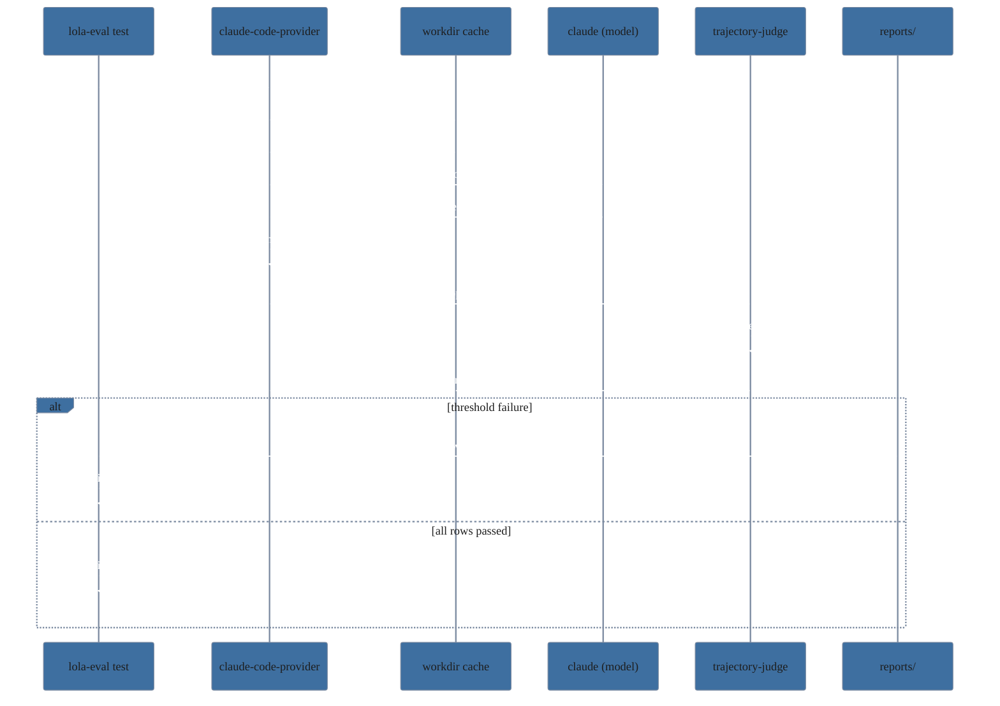
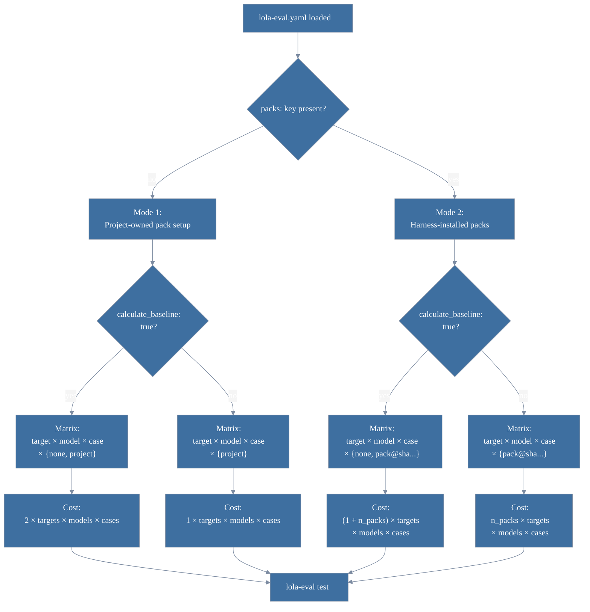
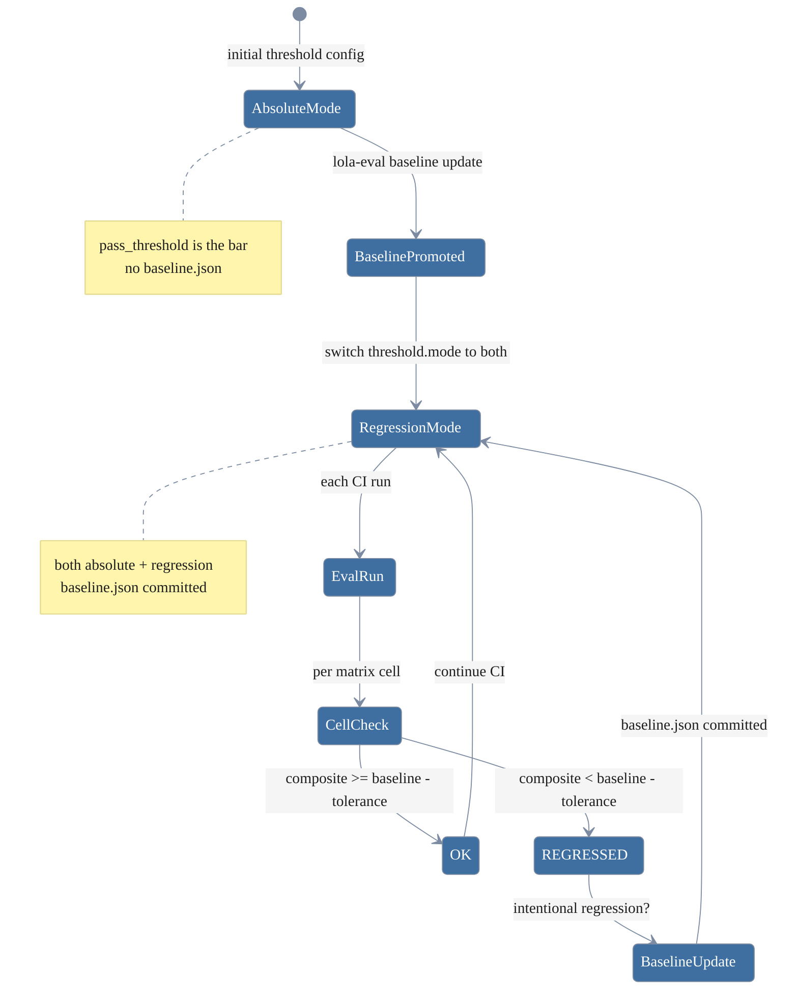
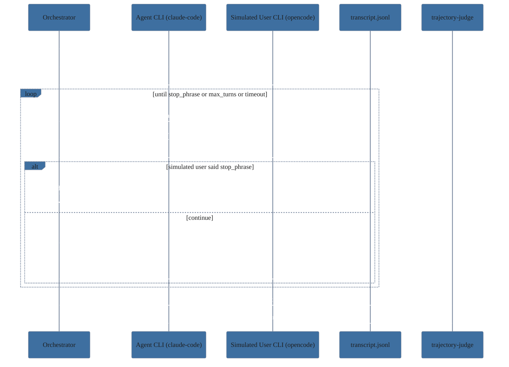

# lola-eval — practical walkthrough

This walks you through using lola-eval end-to-end. The README is a reference; this is the narrative. By the end you will have:

- lola-eval installed and verified
- a target project scaffolded
- a custom test authored
- the test running against a real agent + lola pack
- results streaming into CI
- a regression-mode workflow you can hand to a teammate

Estimated reading time: 25 minutes. Estimated time to a working CI integration: an afternoon.

## Audience and prerequisites

You are a developer who wants to verify a [lola](https://github.com/RedHatProductSecurity/lola) pack still produces useful results when run through `claude-code` or `opencode` at a particular model version, and you want that signal in CI.

Before starting, you need:

- A Linux box (CentOS Stream 10 / RHEL / Rocky / Alma 9+; Fedora works too)
- The `lola` CLI installed and on `PATH` ([install instructions](https://github.com/RedHatProductSecurity/lola))
- Either `claude` (for `claude-code` targets) or `opencode` on `PATH`, pre-authenticated
- Network access for the first `lola install` of any pack
- A target project (any language) where you want to embed lola-eval tests

## Step 1: Install lola-eval

The only consumer-facing distribution is RPM. The package bundles its own Python and Node interpreters and a vendored promptfoo install, so you do **not** need to manage Python or Node versions on the host.

```sh
# Replace the URL with wherever your release lives. The RPM is ~450 MB
# because it bundles full interpreters; this is intentional.
sudo dnf install -y https://example.invalid/releases/lola-eval-0.2.0-1.el10.x86_64.rpm
```

Verify:

```sh
lola-eval --version
# lola-eval 0.2.0

lola-eval doctor
```

A clean `doctor` looks like this:

```
== lola-eval doctor ==
  [OK] python3    Python 3.12.6 (bundled)
  [OK] node       v22.22.2 (bundled)
  [OK] promptfoo  0.121.11 (bundled)
  [OK] promptfoo engines  node 22.22.2 satisfies '^20.20.0 || >=22.22.0'
  [OK] bundle Python pin   3.12.6 matches versions.txt
  [OK] bundle Node pin     22.22.2 matches versions.txt
  [OK] lola       lola 0.4.4
  [OK] claude     2.1.131
  [OK] opencode   1.14.39
  [..] runs.db    -> /home/you/.local/state/lola-eval/runs.db

result: OK
```

The `engines` line catches the specific class of bug where a newer promptfoo bumps its required
Node and the bundled Node falls below the floor. The pin lines compare each binary's `--version`
against `/opt/lola-eval/share/versions.txt`, surfacing any drift between what was pinned at build
time and what's actually installed. Inside a target repo, the `runs.db` line points at
`<target>/<results_dir>/runs.db` instead of the XDG fallback.

If `doctor` flags `lola` as missing, install it first — `lola-eval` will not run pack-installing steps without it. The agent CLIs (`claude`, `opencode`) are probed unconditionally: missing ones surface as informational `[..]` lines outside a target repo, and only escalate to an error when your `lola-eval.yaml` references that CLI. Inside a target repo, present CLIs that are referenced by config gain a `(claude-code)` or `(opencode)` label so you can see at a glance which CLI maps to which config entry.

## Step 2: Bootstrap a target project

`cd` into the repo where you want lola-eval tests to live (it can be any kind of repo — Python, Go, Rust, JS, doesn't matter; lola-eval is testing the agent's behaviour against your code, not the code itself).

```sh
cd ~/code/my-project
lola-eval init
```

Output:

```
wrote /home/you/code/my-project/lola-eval.yaml
wrote example test at /home/you/code/my-project/tests/lola-eval/example
appended 5 line(s) to /home/you/code/my-project/.gitignore:
  .lola-eval/runs.db
  .lola-eval/transcripts/
  .lola-eval/reports/
  .lola-eval/junit.xml
  .lola-eval/workspace/
```

That's all `init` does. It is idempotent: re-running without `--force` refuses to overwrite `lola-eval.yaml`, skips the example scaffold if `tests/lola-eval/` already has content, and never duplicates `.gitignore` lines.

Inspect what landed:

```sh
tree -L 3
```

```
.
├── .gitignore
├── lola-eval.yaml
└── tests
    └── lola-eval
        └── example
            ├── prompt.md
            ├── rubric.md
            ├── starter
            │   ├── README.md
            │   ├── pyproject.toml
            │   ├── src
            │   └── tests
            └── task.yaml
```

## Step 3: Tour the scaffold

Two files matter most.

### `lola-eval.yaml`

```yaml
targets:
  - cli: claude-code
    models:
      - sonnet                          # latest sonnet alias
      - claude-haiku-4-5-20251001       # pinned smaller model

calculate_baseline: false               # set true for a "none" pass alongside "project"

threshold:
  mode: absolute
  tolerance: 0.05
  timeout_is_failure: true

concurrency: 4
tests_dir: tests/lola-eval
results_dir: .lola-eval

judges:
  - {cli: claude-code, model: sonnet}

aggregation: mean
disagreement_threshold: 0.15

ci:
  junit_xml: true
  github_summary: true
  html_report: true
```

This is **Mode 1 (in-repo)**: the project under evaluation provisions its own packs (user-scope `lola install` before CI, project-level install script, whatever you prefer). The harness runs a single pass per cell with `pack_id="project"`. If you'd rather have the harness install one or more *external* packs itself per row — typical when reviewing a third-party pack you don't own — switch to **Mode 2** by adding a `packs:` list (see Step 7).

Reading the file top to bottom:

- `targets` — the matrix of agent CLIs × models you want to test against. Each `(cli, model)` pair becomes one row per `(case, pack_id)`.
- `calculate_baseline` — when `true`, every cell also gets a clean-workdir `pack_id="none"` pass that disregards your project's pack setup, giving `compare`/`lift` a denominator for measuring uplift. Doubles the matrix cost. Default `false`.
- `threshold` — pass/fail mode. `absolute` means each test fails when its `composite < pass_threshold` (defined in the test's rubric). Stateless, no commits required.
- `concurrency` — how many rows promptfoo runs in parallel.
- `judges` — who grades the agent's output. By default, the same model as the first target. Multi-entry enables consensus scoring (Step 12).
- `ci` — outputs to write after each run.

Almost every field has a sensible default; the minimum viable `lola-eval.yaml` is 3 lines:

```yaml
targets:
  - {cli: claude-code, models: [sonnet]}
```

### `tests/lola-eval/example/`

The example is a runnable code-review test. Walk through its files:

`task.yaml` — metadata only:

```yaml
task_version: "1"
description: |
  Review a small Python module that has multiple intentional flaws
  spanning security, correctness, and documentation. The agent must
  produce a structured review at REVIEW.md listing issues.
timeout_seconds: 600
```

`task_id` is **not** in this file — it is the directory name (`example`). Don't add it.

`prompt.md` — what gets handed to the agent verbatim:

```
Review the Python module in this directory. It has several
flaws — security issues, correctness bugs, documentation gaps,
and operational concerns.

Produce a structured review at `REVIEW.md` in this directory.
The review should list each finding with:

- a one-line summary
- a severity (critical/high/medium/low)
- the file and line(s) involved
- a suggested fix

If a `/example-pack` slash command is available in this
session, prefer using it — it produces a more structured review.
Otherwise produce the review from your own analysis.

End the session as soon as `REVIEW.md` is written.
```

`rubric.md` — frontmatter (machine-read) + body (judge-read):

```
---
rubric_version: "1"
pass_threshold: 0.6
weights:
  coverage: 0.5
  structure: 0.3
  actionability: 0.2
---

# Rubric: <name>

The agent was asked to review a Python module with several intentional
flaws and produce a `REVIEW.md`. Score the resulting review file.
…
## coverage (weight 0.5)
…
## structure (weight 0.3)
…
## actionability (weight 0.2)
…

## output

Return strict JSON:

{
  "components": {
    "coverage": <float>,
    "structure": <float>,
    "actionability": <float>
  },
  "explanation": "<one-paragraph rationale>"
}
```

The frontmatter is the only part the runner reads. `weights` must sum to 1.0 ± 0.001 (`lola-eval doctor` will flag a mismatch). The body is shown verbatim to the judge.

`starter/` — the working directory the agent gets to edit. `lola-eval` copies this into a fresh workspace before each row, so the agent always sees a pristine starting state.

## Step 4: Run the example



Estimate cost first:

```sh
lola-eval test --estimate-cost
```

```
Cost estimate (upper bound):
  mode:     Mode 1 (in-repo)
  cases:    1
  targets:  1
  cells:    2  (cli × model)
  packs:    1
  baseline: off
  rows:     2
  judges:   1
  per-call: $2.50
  -----
  TOTAL:    $10.00

Note: per-call uses a $2.50 upper bound. Real cost varies 10x
across model tiers (haiku < sonnet < opus). Treat this as a
conservative ceiling, not a forecast.
```

`targets` counts entries in the `targets:` list (typically one per CLI); `cells` is the real (cli × model) fanout — the number you want to compare against `rows`. The "rows" number is `cells × passes_per_cell × cases`, where `passes_per_cell` is the number of `pack_id`s in play: 1 in Mode 1 (`project`), plus 1 if `calculate_baseline: true`, plus the length of `packs:` in Mode 2. The `(1 + judges)` multiplier covers the agent run plus each judge's grading call. Real cost on a small case with sonnet for both agent and judge is closer to $0.20–$0.50 per row. The estimate is a ceiling for budgeting, not a forecast.

Run it:

```sh
lola-eval test
```

Expected output (annotated):

```
[claude-code-provider] run_id=a1b2c3d4 task=example pack=project model=sonnet
[claude-code-provider] transcript: /home/you/code/my-project/.lola-eval/transcripts/a1b2c3d4-….jsonl  (tail -f to watch)
[claude-code-provider] reset workdir → /home/you/.cache/lola-eval/work/example/sonnet/project
[claude-code-provider] install pack project (workdir-scoped) ... (no-op; project handles its own pack setup)
[claude-code-provider] spawning claude (model=sonnet, budget=$2, timeout=600s)…
                       ┌── these stderr breadcrumbs come from the JS provider; they
                       │   tell you which row is in flight and where its transcript lives
[claude-code-provider] claude returned (exit=0, timedOut=false, duration=42.3s)
[claude-code-provider] captured 3 turns, 5 tool calls, exit_status=success
[claude-code-provider] done. handing envelope to judge.

[trajectory-judge] row run_id=a1b2c3d4 fp=… exit=success
[trajectory-judge] judge claude-code/sonnet -> composite=0.85
                   └── per-row judge result; appears once per (row × judge)
…

[lola-eval-test] 2 rows complete; 0 failures; 0 timeouts
[lola-eval-test] threshold mode: absolute
```

If a row fails its threshold, the failure block follows:

```
Failures:
  FAIL claude-code/sonnet/example/project: composite 0.40 < rubric pass_threshold 0.60
See .lola-eval/reports/20260509T153012Z.html for the judge's per-row rationale.
```

Exit codes:

| Code | Meaning |
|------|---------|
| 0 | All rows passed the active threshold mode |
| 1 | At least one threshold failure |
| 2 | Setup error (config invalid, malformed fixture, missing baseline in regression mode, empty matrix after filters) |
| 3 | At least one row hit an infrastructure failure: `target_timeout` (with `timeout_is_failure: true`), `no_run_produced`, `judge_error`, or `setup_error` |

The `setup_error` kind covers provider-side failures like `install_pack.sh` returning non-zero (typically `lola install` reporting "Module not found"). The cell's `failure_reason` carries the actionable message verbatim, so the failure list above pinpoints the specific pack or workdir at fault.

Precedence is `2 > 3 > 1 > 0`: setup errors trump everything, infra failures trump threshold ones.

## Step 5: Read the results

After a run, `.lola-eval/` looks like this:

```
.lola-eval/
├── runs.db                      # SQLite, append-only history of every row
├── transcripts/
│   └── a1b2c3d4-….jsonl         # raw stream-json from the agent CLI
├── reports/
│   └── 20260509T153012Z.html    # full HTML report for this run
├── junit.xml                    # latest run only; CI consumers read this
├── workspace/                   # ephemeral promptfoo workspace; safe to delete
└── last-run.json                # latest run summarized (driver for `baseline`)
```

`junit.xml` is what your CI consumes. Standard junit format — one `<testcase>` per `(target, case, pack)` row. Failures are surfaced as `<failure>` elements with the threshold message. Timeouts are `<error>` elements.

The HTML report (`reports/<ts>.html`) — titled "lola-eval run report" — has more depth: a "Per-row breakdown" section with composite vs threshold, cost/duration/token counts, per-criterion scores, the judge's free-text rationale (extracted from `explanation` in the judge's JSON output), and the transcript path for each row; plus the Drift Δ, Lift %, Compare (baseline vs pack), and Infra failures tables. Time-series charts are intentionally NOT embedded — terminal ANSI art is illegible in a browser. For trends, run `lola-eval graph` in the terminal.

`last-run.json` is the input for `lola-eval baseline update` — it captures the most recent run's per-cell composites so you can promote them to the regression baseline.

`runs.db` accumulates forever (until you `lola-eval clean --state`). This is the source for time-series queries: `lola-eval graph`, `lola-eval drift`, `lola-eval lift`, `lola-eval compare`.

## Step 6: Author your own test

The example is a generic Python-review task. Replace it with something specific to *your* codebase. Workflow:

1. **Decide what you're verifying.** Pick a concrete capability you want the pack to reliably deliver. Examples:
   - "Given a PR diff, the agent identifies all OWASP-Top-10 issues."
   - "Given a stack trace, the agent suggests the right log-line to add."
   - "Given a YAML config, the agent flags missing required keys."

2. **Build a starter directory** that contains the input the agent will see. This goes under `tests/lola-eval/<your-case-id>/starter/`. It can be code, configs, prose — whatever the prompt asks the agent to operate on. Files are copied verbatim into a fresh workspace per row.

3. **Write the prompt** at `tests/lola-eval/<your-case-id>/prompt.md`. Keep it short and unambiguous about *what to produce* (a file, a JSON blob, a specific format). Example:

   ```
   Review the SQL migration in this directory.

   Produce `MIGRATION_REVIEW.md` in this directory listing every issue
   you find. Each finding must include:

   - severity (critical/high/medium/low)
   - the migration file and approximate line
   - whether the issue is reversible

   End the session as soon as MIGRATION_REVIEW.md is written.
   ```

4. **Write the rubric** at `tests/lola-eval/<your-case-id>/rubric.md`. The frontmatter declares how the judge scores; the body explains what each criterion means. Critical pieces:

   - `pass_threshold`: composite score below this fails the test in `absolute` mode.
   - `weights`: per-criterion weights, must sum to 1.0.
   - The body must end with a strict-JSON output schema the judge will produce. The runner expects `{"components": {...}, "explanation": "..."}`.

   Tip: ground every criterion in something the judge can *count* or *check*, not something subjective. "Did the review identify the SQL injection?" is gradeable. "Was the review well-written?" is not.

5. **Stamp the metadata** at `tests/lola-eval/<your-case-id>/task.yaml`:

   ```yaml
   task_version: "1"
   description: |
     One-paragraph human-readable summary of what this case verifies.
   timeout_seconds: 600
   ```

6. **Validate locally** before running the agent:

   ```sh
   lola-eval doctor
   ```

   Doctor walks every case directory, validates the rubric frontmatter, checks `weights` sums to 1.0 (± 0.001), and flags missing files. Fixture problems — bad weights, missing `prompt.md`, missing `starter/`, malformed task YAML — surface as `[ERR]` lines and make `doctor` exit non-zero, so a CI step that runs `lola-eval doctor` before `lola-eval test` catches them before paying for a $5 LLM run.

7. **Bump versions when you edit.** `task_version` in `task.yaml` and `rubric_version` in `rubric.md` are part of the [row fingerprint](#how-fingerprints-work). Two rows with different versions are graphed and regressed independently. Forgetting to bump means later results overwrite older ones in trend lines.

## Step 7: Evaluate an external pack (Mode 2)



Mode 1 (the default scaffold) is right when the project under evaluation owns its lola configuration — your team's CI verifying your team's pack setup. Switch to **Mode 2** when you want the harness itself to install one or more packs per row. The canonical use case: reviewing a third-party pack you might adopt, where you don't want to (or can't) bake it into the project under evaluation.

The two modes are mutually exclusive: presence or absence of the `packs:` key picks which one is active. The loader rejects configs that mix them.

To switch, resolve the pack's SHA:

```sh
lola show example-pack --json | jq -r '.head_sha'
# 1a2b3c4d5e6f7890abcdef1234567890abcdef12
```

Then edit `lola-eval.yaml` — remove or comment out `calculate_baseline:` if you want, and add a `packs:` list:

```yaml
packs:
  - example-pack@1a2b3c4d5e6f7890abcdef1234567890abcdef12
calculate_baseline: true     # gives you the "none" denominator for lift
```

`calculate_baseline: true` is almost always what you want in Mode 2, since `compare`/`lift` need both sides of the comparison. List multiple packs to evaluate them in parallel — each becomes its own pack_id and gets its own per-row workdir, so the LLM never sees mixed pack context.

Reserved `pack_id` sentinels that the harness derives for you and refuses to accept in your `packs:` list:

| Sentinel | When it appears | Meaning |
|----------|-----------------|---------|
| `none` | `calculate_baseline: true` | Clean-workdir baseline pass; nothing installed |
| `project` | Mode 1 only (no `packs:`) | The project under evaluation's own pack setup |

Now `lola-eval test` produces 2 rows per case (one without the pack, one with) so you can compare. Run again:

```sh
lola-eval test
```

After it completes, see the lift:

```sh
lola-eval compare
```

```
== baseline-vs-pack comparison ==

claude-code / sonnet / example
─────────────────────────────────────────────────────────────────────
                            none    example-pack    Δ
  composite                 0.61    0.84              +37.7%
  cost (USD)               0.18    0.31              +0.13
  duration (s)             34.2    52.4              +18.2
  turns                    3       5                 +2
  tool calls               6       11                +5
  diff bytes               4203    7891              +3688
  in tokens                12k     14k               +2k
  out tokens               2.4k    3.1k              +0.7k
  cache reads              340k    410k              +70k
  success rate             1.0     1.0               +0.0
─────────────────────────────────────────────────────────────────────
```

Read this as: "with `example-pack` installed, sonnet's composite score went from 0.61 to 0.84 (+37.7%) on this case, at a cost of $0.13 more per row and 18 extra seconds." Whether that's worth the cost is a judgment call you make with the data, not against it.

In **Mode 1** the same table compares `none` against `project` instead of `none` against `example-pack@…` — the columns and semantics are identical, only the right-hand label changes.

## Step 8: Wire to CI

Drop this into `.github/workflows/lola-eval.yml`:

```yaml
name: lola-eval

on:
  pull_request:
    paths:
      - 'src/**'
      - 'tests/lola-eval/**'
      - 'lola-eval.yaml'
  schedule:
    - cron: '0 4 * * 1'   # Monday 04:00 UTC drift-watch run

jobs:
  lola-eval:
    runs-on: ubuntu-latest
    timeout-minutes: 60

    steps:
      - uses: actions/checkout@v4

      # lola-eval RPMs are el10. On ubuntu, run inside a CentOS Stream 10
      # container; on a self-hosted RHEL 9+ runner, install directly.
      - name: Install lola-eval (Ubuntu via container)
        run: |
          sudo apt-get update
          sudo apt-get install -y rpm wget
          wget https://example.invalid/releases/lola-eval-0.2.0-1.el10.x86_64.rpm
          sudo rpm -ivh --nodeps lola-eval-0.2.0-1.el10.x86_64.rpm

      - name: Install lola CLI
        run: |
          # Substitute the lola install you actually use
          curl -fsSL https://lola.example/install.sh | sudo bash

      - name: Authenticate claude
        env:
          ANTHROPIC_API_KEY: ${{ secrets.ANTHROPIC_API_KEY }}
        run: |
          mkdir -p ~/.claude
          echo "$ANTHROPIC_API_KEY" > ~/.claude/api-key

      - name: Run lola-eval
        run: lola-eval test
        env:
          GITHUB_STEP_SUMMARY: ${{ env.GITHUB_STEP_SUMMARY }}

      - name: Upload junit
        if: always()
        uses: actions/upload-artifact@v4
        with:
          name: lola-eval-junit
          path: .lola-eval/junit.xml

      - name: Upload HTML report
        if: always()
        uses: actions/upload-artifact@v4
        with:
          name: lola-eval-report
          path: .lola-eval/reports/
```

Notes:

- The `if: always()` on the artifact-upload steps captures results even when `lola-eval test` exited non-zero. You want the failure artifact more than the success one.
- `$GITHUB_STEP_SUMMARY` is automatically set in GitHub Actions; if `ci.github_summary: true` is in your config, lola-eval appends a per-row markdown table to the action summary.
- The `paths:` filter avoids running the suite on doc-only PRs. Costs add up with frequent runs.
- The Monday schedule catches model drift even when no PRs touch the eval-relevant code.

For GitLab, the equivalent core step:

```yaml
lola-eval:
  image: quay.io/centos/centos:stream10
  before_script:
    - dnf install -y ./lola-eval-*.rpm
    - # install lola, authenticate claude
  script:
    - lola-eval test
  artifacts:
    when: always
    reports:
      junit: .lola-eval/junit.xml
    paths:
      - .lola-eval/reports/
```

## Step 9: Adopt regression mode



`absolute` mode is the right starting place: rubric `pass_threshold` is the bar, no committed state needed, test results are interpretable on first run. As your suite stabilizes, `regression` mode adds a complementary signal: "did *this PR* make the agent worse than it was last week?"

**Migration workflow:**

1. Get a clean run in `absolute` mode that you would commit.
2. Promote it:

   ```sh
   lola-eval baseline update
   # Wrote .lola-eval/baseline.json (4 cells)
   ```

3. Inspect what landed:

   ```sh
   lola-eval baseline show
   ```

   ```
   == baseline.json ==
   claude-code/sonnet/example/none                         0.85
   claude-code/sonnet/example/example-pack@1a2b3c4d…     0.91
   claude-code/haiku-4-5/example/none                      0.61
   claude-code/haiku-4-5/example/example-pack@1a2b3c4d…  0.79
   ```

4. Switch the threshold mode:

   ```yaml
   threshold:
     mode: both            # belt + suspenders: absolute floor + regression check
     tolerance: 0.05
   ```

5. Commit `lola-eval.yaml` and `.lola-eval/baseline.json`.

From here, every CI run compares against the committed baseline. A row passes when `composite >= baseline - tolerance`. To accept a deliberate regression (e.g., you tightened the rubric), update the baseline:

```sh
lola-eval baseline diff
# shows what would change
lola-eval baseline update
git add .lola-eval/baseline.json
git commit -m "Bump baselines for tightened rubric"
```

`lola-eval baseline diff` is your sanity check before committing. It shows:

```
                                                   baseline  latest    Δ        status
claude-code/sonnet/example/none                    0.85      0.83     -0.020   OK
claude-code/sonnet/example/example-pack@…        0.91      0.72     -0.190   REGRESSED
```

`REGRESSED` rows trigger a CI failure; `OK` rows changed within tolerance. Reviewers can read the diff and decide if the regression is intentional.

## Going deeper: multi-judge consensus

A single judge has bias — it might systematically reward verbose reviews or penalize terse-but-correct ones. Multi-judge averages that out at the cost of more LLM calls per row.

Enable by listing multiple judges:

```yaml
judges:
  - {cli: claude-code, model: sonnet}
  - {cli: claude-code, model: claude-haiku-4-5-20251001}
  - {cli: opencode,    model: gpt-4o}      # cross-vendor opinion

aggregation: mean              # mean | median | min | trimmed_mean
disagreement_threshold: 0.15
disagreement_action: warn      # warn | fail | off
```

Cost scales linearly: 3 judges = 3x the judge call cost per row. The agent run itself is unchanged. `lola-eval test --estimate-cost` accounts for this:

```
  rows:     8
  judges:   3
  per-call: $2.50
  TOTAL:    $80.00
```

Aggregation strategies:

| Mode | When to use |
|------|-------------|
| `mean` (default) | Smooth, intuitive, matches single-judge for n=1 |
| `median` | Robust to one outlier; most useful with 3+ judges |
| `min` | Pessimistic floor; row passes only if the strictest judge agrees. Good for "must not regress" gates |
| `trimmed_mean` | Drop highest+lowest before averaging. Requires N≥3 judges. Stable middle-mean that resists a single outlier in either direction; the loader rejects the config if you use it with fewer judges |

`disagreement_threshold` and `disagreement_action` work together to decide what happens when judges diverge:

| `disagreement_action` | Behavior when stddev > threshold |
|-----------------------|----------------------------------|
| `warn` (default) | Log to stderr; row still passes/fails on its composite alone. Same as Phase-1 behavior. |
| `fail` | Mark the row failed with `failure_kind=judge_disagreement`. The composite is still reported truthfully; the row simply doesn't get to "pass" purely on score. Surfaced as a row-level failure (exit 1) — distinct from the infrastructure failures (exit 3) like `judge_error`. |
| `off` | Compute and persist disagreement but emit no warning. |

The `warn` example output:

```
⚠ judge disagreement on claude-code/sonnet/example/example-pack@…: 0.247 > threshold 0.150
```

Common causes of disagreement: the rubric is ambiguous, the agent's output straddles a scoring boundary, or one judge model has a known bias on this kind of content. Use `disagreement_action: fail` when you want CI to block on these so a human reviews before scores are taken at face value.

## Interactive simulated-user mode (Phase 2)



By default a target runs **autonomously**: the agent gets the prompt, runs to completion, and the judge grades the result. Some tasks are better evaluated as a multi-turn dialog — the agent asks clarifying questions, the user pushes back, eventually they converge. lola-eval supports this via `exec_mode: interactive`:

```yaml
targets:
  - cli: claude-code
    models: [sonnet]
    exec_mode: interactive       # autonomous (default) | interactive
    max_turns: 5                 # hard cap on dialog turns
    simulated_user_cli: opencode # CLI that plays the human role
    simulated_user_model: claude-sonnet-4-6
```

When a target sets `exec_mode: interactive`, each case must additionally have a `simulated_user.md` describing the persona and stop conditions:

```
tests/lola-eval/example/
├── task.yaml
├── prompt.md
├── rubric.md
├── simulated_user.md           # NEW (required for interactive)
└── starter/
```

`simulated_user.md` shape (frontmatter is optional):

```yaml
---
persona_version: 1
max_turns: 5            # overrides per-target max_turns when set
stop_phrase: DONE
---

You are a senior backend engineer asking the assistant to fix a failing test.
Your goal: the test suite must pass after their changes.

Style guidelines:
- Be terse. One or two sentences per turn.
- Don't paste code. Ask about reasoning, not lines.
- When you're satisfied, say "DONE" (a single word) to end the conversation.
```

The orchestrator runs the dialog turn-by-turn (subprocess-per-turn — each invocation gets the full conversation history as a flat-text prompt) until the simulated user emits `stop_phrase`, `max_turns` is reached, or a subprocess hits its per-turn timeout. The full transcript (one JSONL event per turn) lands in `<results_dir>/transcripts/<run-id>.jsonl` for the judge to grade.

Interactive runs split from autonomous runs in drift queries — the row fingerprint includes `exec_mode`, so a pack helping interactive workflows but hurting autonomous ones (or vice versa) is visible as a separate trend line. Mixing both in one matrix is supported.

If `exec_mode: interactive` is set but a case is missing `simulated_user.md`, the runner refuses to start with a clear error pointing at the missing file path.

## Going deeper: drift over time

`runs.db` accumulates every run. Time-series queries operate on it.

```sh
lola-eval drift
```

For each (cli, model, task, pack) cell, drift compares the latest row to the earliest row. Useful for "did this cell get worse since we started tracking?":

```
== drift ==
  fingerprint   c4d5e6f7…
  task          example
  pack          none
  model (now)   claude-sonnet-4-6
  model (then)  claude-sonnet-4
  Δ composite   -0.07  ▼ regression
  runs          12
```

`▼` is a regression vs the historical earliest. `▲` is improvement.

For visual trend lines:

```sh
lola-eval graph --cell claude-code/sonnet/example
```

Renders an ANSI plot in your terminal, one colored line per pack, X-axis is the run sequence. Pipe to `less -R` to scroll long histories. The HTML report does NOT embed these charts — they're terminal-only art. The HTML report's "Per-row breakdown" covers the per-row detail; use `lola-eval graph` for trend lines.

## Going deeper: comparing baseline vs pack

Pair `calculate_baseline: true` with either a Mode 1 (project) or Mode 2 (external `packs:`) config and `compare` shows the lift per cell. Already shown in Step 7; the full table includes cost, duration, turns, tool calls, diff bytes, token counts (input/output/cache reads/cache creation), and success rate.

`lola-eval lift` is a more compact form — just the composite delta:

```
== signed lift % ==
  claude-code / sonnet / example
  baseline (none)            0.61
  pack    example-pack@…   0.84
  lift                      +37.7%   ▲ pack improved the agent
```

Both tables pull from `runs.db`, so they grow more useful over many runs as confidence intervals tighten.

## Day-to-day operations cheat sheet

```sh
lola-eval doctor                        # before anything; verifies bundle + config + fixtures
lola-eval test                          # the main loop; exits 0/1/2/3 per threshold
lola-eval test --pack none              # Mode 2/calculate_baseline aid: rerun only baseline rows
lola-eval test --pack project           # Mode 1 aid: rerun only the project pass
lola-eval test --pack example-pack@…  # Mode 2 aid: rerun only one external pack
lola-eval test --case my-case           # rerun only one fixture
lola-eval test --no-baseline            # skip pack_id=none rows (only meaningful when calculate_baseline=true)
lola-eval test --estimate-cost          # dry-run cost estimate; does not invoke any LLM
lola-eval test --profile bare           # run one profile only
lola-eval test --concurrency 1          # serialize for cleaner stderr during debugging

lola-eval baseline show                 # current committed baseline
lola-eval baseline diff                 # latest run vs committed baseline (pre-commit sanity)
lola-eval baseline update               # write last-run scores into baseline.json

lola-eval compare                       # exhaustive baseline-vs-pack table
lola-eval lift                          # signed lift % per cell
lola-eval drift                         # signed drift Δ per fingerprint
lola-eval graph [--cell <c>/<m>/<t>]    # ANSI time-series chart per cell
lola-eval report                        # rebuild HTML report from runs.db
lola-eval report --format markdown      # markdown comparison report with profile columns

lola-eval clean --cache                 # wipe regenerable workspace/transcripts/reports
lola-eval clean --state                 # also wipe runs.db + last-run.json (preserves baseline.json)
```

## Step 10: Compare agent configurations with profiles

Profiles let you evaluate the same test case across different agent configurations — for example,
a bare agent versus one loaded with your team's AGENTS.md or a plugin framework.

### Create a profiles directory

```sh
mkdir -p profiles/configs/claude-bare/.claude
```

### Write a common base

`profiles/common.yaml` defines defaults inherited by all profiles:

```yaml
name: common
budget: 10
timeout: 1800
skip_permissions: true
post_prompt:
  - "Are you satisfied with your work? If not, fix what troubles you."
```

### Write profile variants

`profiles/bare.yaml` — a clean room baseline:

```yaml
name: bare
description: No plugins, no system prompt, no follow-up
system_prompt_file: ""
post_prompt: []
compatible_targets:
  - claude-code
setup:
  claude-code:
    flags: ["--bare"]
    replace_config: configs/claude-bare
    remove: [AGENTS.md, CLAUDE.md]
```

`profiles/personal.yaml` — your team's AGENTS.md injected:

```yaml
name: personal
description: Team AGENTS.md applied
compatible_targets:
  - claude-code
setup:
  claude-code:
    flags: ["--bare"]
    replace_config: configs/claude-bare
    remove: [CLAUDE.md]
    copy:
      - src: fixtures/AGENTS.md
        dst: AGENTS.md
        mode: append
        tag: team-guidelines
```

Create the config template and fixtures:

```sh
echo '{"enabledPlugins": {}}' > profiles/configs/claude-bare/.claude/settings.json
mkdir -p profiles/fixtures
cat > profiles/fixtures/AGENTS.md << 'EOF'
# Team Guidelines
- Run tests after each edit
- Keep changes minimal and focused
EOF
```

### Reference profiles in lola-eval.yaml

```yaml
targets:
  - cli: claude-code
    models: [sonnet]

profiles_dir: ./profiles
profiles:
  - bare
  - personal

threshold:
  mode: absolute
```

### Run and compare

```sh
lola-eval test                           # runs all profiles × all cases
lola-eval test --profile bare            # run one profile at a time
lola-eval report --format markdown       # generate a markdown comparison report
```

The markdown report includes a **Profile** column in every table, making it easy to see how
different configurations affect scores, cost, and trajectory.

### Setup directives

Each profile's `setup` section runs before the agent, in order:

1. **`replace_config`** — replaces the tool's config directory (`.claude/` or `.opencode/`) with a
   clean template. Prevents user plugins and settings from leaking into the evaluation.
2. **`remove`** — deletes listed files from the workdir.
3. **`copy`** — copies files into the workdir. Use `mode: append` with a `tag` to inject content
   with bookend markers (`<!-- BEGIN tag -->` / `<!-- END tag -->`) for idempotent re-application.

### Inheritance

Profile fields inherit from `common.yaml` via shallow merge (profile values override). The `setup`
key is never inherited — each profile must define setup for every target in its `compatible_targets`.

Use `null` (or omit the key) to inherit; use an explicit empty value to override to nothing:
- `post_prompt: null` → inherits from common.yaml
- `post_prompt: []` → no follow-up messages

## How fingerprints work

Every row inserted into `runs.db` gets a *fingerprint* — a sha256 over the tuple `(target_cli, pack_id, task_id, task_version, rubric_version, exec_mode, invocation_style, profile_id)`. `target_model` is **excluded** by design: drift is the signal of a fixed-config behaviour changing as the model evolves under it.

What this means in practice:

- Bumping `task_version` or `rubric_version` produces a new fingerprint. The old fingerprint's history is preserved but no longer extended. New runs against the new version start a fresh trend line.
- Swapping the agent model (e.g. `sonnet` → `claude-sonnet-4-7`) keeps the fingerprint and adds new rows under the same trend. `lola-eval drift` will surface the score delta.
- Swapping the pack SHA (`example-pack@<old>` → `example-pack@<new>`) produces a new fingerprint because `pack_id` includes the SHA. Old and new are graphed independently.

## Troubleshooting (greatest hits)

**`lola-eval test` shows `no_run_produced` for every row.** Infrastructure issue. The agent ran but the judge subprocess didn't write a row. Most common cause: the bundled python-assert callback can't import `lola_eval`. Run `lola-eval doctor` to confirm the bundle is intact. If you're running from source instead of the RPM, check `PYTHONPATH`.

**`lola-eval test` shows `target_error` for every row.** The agent CLI itself crashed. Verify outside lola-eval:

```sh
claude --version    # for claude-code targets
opencode --version  # for opencode targets
```

If those work, inspect the per-row transcript at `<results_dir>/transcripts/<run_id>.jsonl` — the agent's stream-json output usually shows what happened.

**Tests pass locally but fail in CI.** Most common: `lola` or `claude` not on the runner's PATH. Add a setup step that runs `lola-eval doctor` before `lola-eval test` and treat its non-zero exit as a hard CI fail.

**Costs are exploding.** Use `--estimate-cost` before running. Drop the haiku judge if you have multiple judges. If you've set `calculate_baseline: true`, use `--no-baseline` during pack iteration to halve the matrix. Use `--case` to pin to one fixture and `--profile` to pin to one profile during debugging.

**A row score collapsed to 0.40 and the failure message is opaque.** Open `<results_dir>/reports/<latest>.html` — the per-row panel shows the judge's `explanation` field. If the explanation says the agent didn't produce the expected file, look at the transcript. If it says the agent produced something but the judge couldn't parse it, the rubric's output schema and the prompt's output expectation are mismatched.

**`baseline diff` shows `MISSING` rows.** Either you removed a (cli, model, task, pack) cell from the matrix (deliberate), or the latest run didn't produce that row (look for `no_run_produced` or `target_error` in stderr). Run `baseline update` if the removal is intentional.

## Where to go from here

- The README's [Configuration reference](../README.md#configuration-reference) is the authoritative field-by-field schema for `lola-eval.yaml`, `task.yaml`, and `rubric.md` frontmatter.
- The [design spec](superpowers/specs/2026-05-09-embeddable-runner-design.md) covers the maintainer-facing internals: packaging, runner architecture, multi-judge consensus, fingerprint composition.
- For pre-1.0 changes: this repo's branch history is more useful than any changelog — every commit since `phase-1-monolith-checkpoint` includes a rationale in the body.
